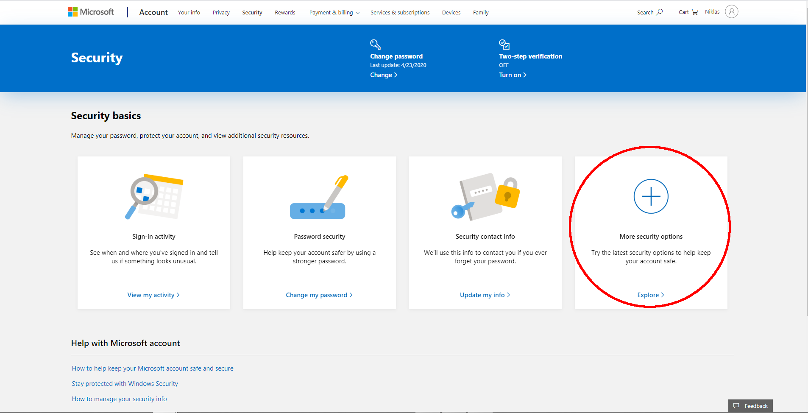

# Passwordless Authentication with Microsoft

The Nitrokey FIDO2 supports password-less authentication, where entering a password is replaced by logging in with the Nitrokey FIDO2 and a PIN.

## Sample login to Microsoft with the Nitrokey FIDO2

1. Click on "Sign in with security key".

2. Enter your PIN for the Nitrokey FIDO2.

3. Touch your Nitrokey FIDO2 at the indicated spot.

4. Now you are logged in!

## Setting up Passwordless Authentication

Here we offer you a guide on how to set up passwordless authentication for your Microsoft account with the Nitrokey FIDO2.

1. You need Windows 10 (update October 2018 or later) and the Microsoft Edge or Google Chrome browser.

2. Log in to your Microsoft account and go to your "Account" page.

3. Select "Security".

4. Select "More security options"

5. Select "Set up a security key".

6. Confirm with "Next" under "USB device".

7. Enter a PIN that you want to use for your Nitrokey FIDO2 and then select "Next".

8. Now tap on the marked position of the Nitrokey FIDO2.

9. Confirm with "Allow".

10. Name your Nitrokey FIDO2 and then select "Next".

 

11. Now you have successfully set up password-free authentication for your Microsoft account!
Confirm with "Got it".

