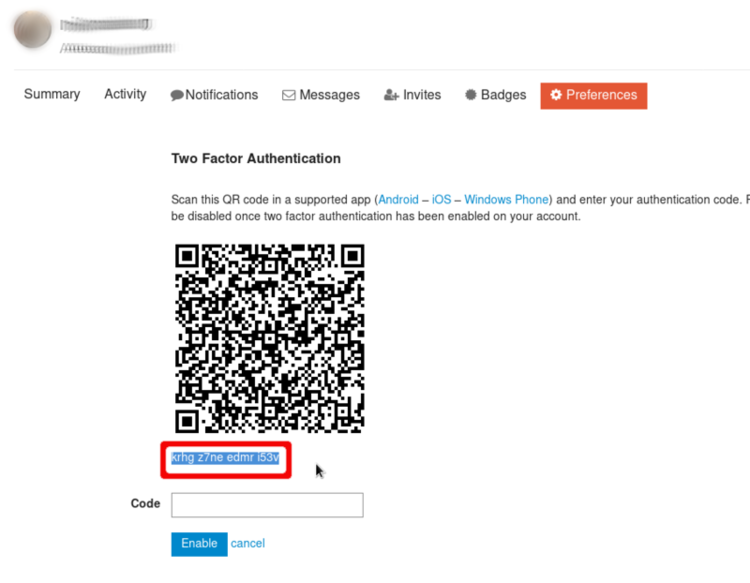
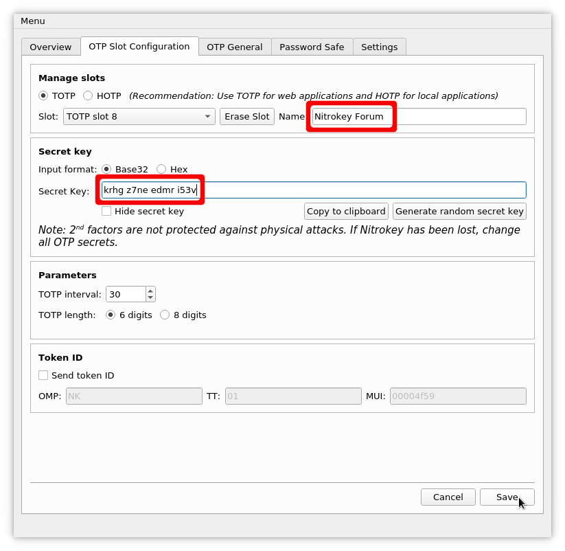
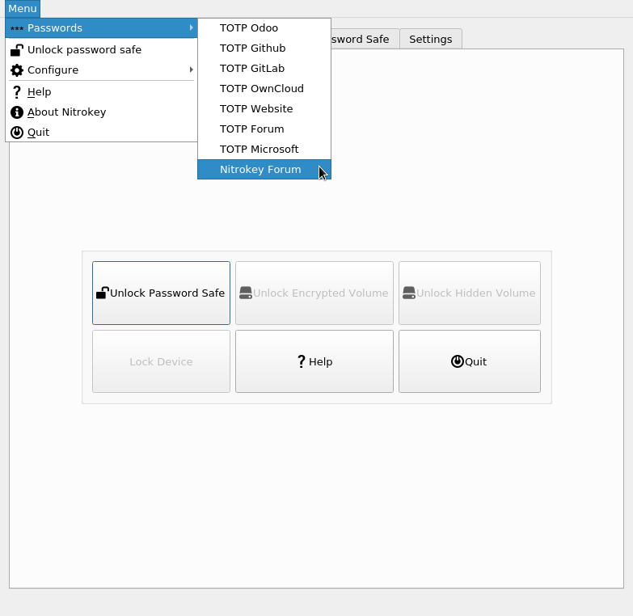

# Two-factor Authentication with your Nitrokey

The use of One-time Passwords (OTP) is called very differently on the various services supporting it. Sometimes it is referred to as Multi-factor Authentication (MFA), sometimes it is Two-factor Authentication (2FA) or just "authentication via authenticator app" like Google Authenticator. Most of these services are compatible for usage with the Nitrokey Pro and Nitrokey Storage. The following instructions show how to enable OTP on our [support forum](https://support.nitrokey.com/). The procedure is quite similar on most services. For a list of websites supporting OTP have a look at [dongleauth.info](https://www.dongleauth.info/).

You need to have the [Nitrokey App](https://www.nitrokey.com/download) installed to use the OTP feature of the Nitrokey Pro and Nitrokey Storage.

## Configure a Website/Application to Use OTP

Login to the website which supports OTP (in this example, the [support forum](support.nitrokey.com/)). Usually you find the option to enable two-factor-authentication under your profile or in the settings.

Most of the time, you will get a QR-Code as seen below. There should be an option, to show the secret key directly.

We need to copy the secret code.

This is what the Nitrokey is actually protecting. You may create a backup of it now (in case the Nitrokey get lost or breaks) by writing it down on a sheet of paper and storing it securely. But be aware that anybody who is in possession of this secret code, can create one-time passwords for your account! *Please note that you won't be able to backup this code, once it is stored in the Nitrokey!*

Now start the Nitrokey App and open the "OTP Slot Configuration".

Paste in the secret key in the corresponding field and choose an appropiate slot name. Click on "Save" and type in your admin PIN if requested.

After saving the slot you can go to "Menu" -> "Passwords" -> YourSlotName to get your very first one-time password.

The one-time password is copied to your clipboard automatically. You just need to paste it to the field on the website to confirm the correct setup and thus to activate the two-factor authentication.

## Securely Login to Website/Application

From now on you will get asked for a one-time password additionally to your other credentials if you try to login the the website. You just need to open the Nitrokey App and go to "Menu" -> "Passwords" -> YourSlotName again to get the one-time password.

