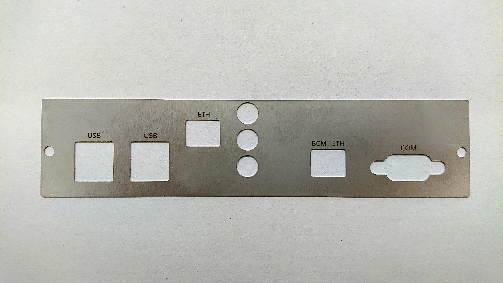

Getting Started
---------------

Connect the NetHSM's ETH port with the network. Don't use the BMC ETH port because it allows wider system access.

The NetHSM appliance is available at address 192.168.1.1. Access and initialize the NetHSM using `nitropy command line tool <cli.html>`_. Alternatively, the `REST API <api.html>`_ and `PKCS#11 driver <pkcs11.html>`_ can be used.

