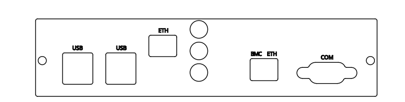

NetHSM
============================

Verification of Sealed Hardware
^^^^^^^^^^^^^^^^^^^^^^^^^^^^^^^

Your NetHSM has been delivered in a sealed bag. Please `verify the sealing <sealed-hardware.html>`_ before unpacking. If you do not know what this means, skip this section.

Getting Started
^^^^^^^^^^^^^^^

Connect the NetHSM's ETH port with the network. Don't use the BMC ETH port because it allows wider system access. Then set the password for the BMC.

The NetHSM appliance is available at address 192.168.1.1. Access and initialize the NetHSM using `nitropy command line tool <cli.html>`_. Alternatively, the `REST API <api.html>`_ and `PKCS#11 driver <pkcs11.html>`_ can be used.

.. toctree::
   :maxdepth: 1
   :glob:

   #faq.rst
   #gettingstarted/index.rst 
   sealed-hardware.rst
   cli.rst
   pkcs11.rst
   api.rst
   tags.rst
   integration.rst
   dev-and-test.rst
   REST API Index <https://nethsmdemo.nitrokey.com/api_docs/index.html#docs/summary/summary> 

