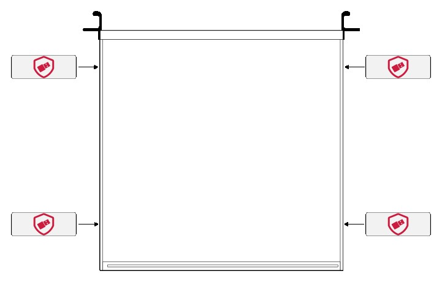
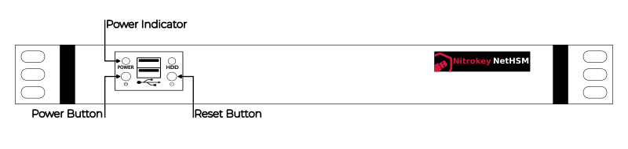

Installation
============

This chapter describes the physical installation and provisioning of the NetHSM.

Verify Sealed Hardware
----------------------

Your NetHSM hardware has been delivered in a sealed packaging.

Please follow the three step process closely to verify that it has arrived safely.

1. Check the wrapping paper for any tears, cuts, holes or broken sealing.

.. figure:: ./images/package-front.jpg
    :scale: 100
    :alt: Package front side

    Package front side
|

.. figure:: ./images/package-back.jpg
    :scale: 100
    :alt: Package back side

    Package back side
|

.. figure:: ./images/package-bottom.jpg
    :scale: 100
    :alt: Package bottom side

    Package bottom side
|

.. figure:: ./images/package-top.jpg
    :scale: 100
    :alt: Package top side

    Package top side
|

.. figure:: ./images/package-left.jpg
    :scale: 100
    :alt: Package left side

    Package left side
|

2. Check the unique handmade glitter seal on top of the wrapping paper.
You will receive a picture of it from us after wrapping.
Compare the received picture with the seal.
If you notice any changes, please contact us to arrange further action.

.. figure:: ./images/package-top-seal.jpg
    :scale: 100
    :alt: Package sealing

    Package sealing
|

3. After verifying that the sealing of the wrapping paper is not broken, remove the wrapping paper.
Finally, check the four seals on the side of the NetHSM hardware.

    Positions of the four seals
|

.. figure:: ./images/server-side-with-seal.jpg
    :scale: 100
    :alt: Seal on the side of the chassis

    Seal on the side of the chassis

Hardware installation
---------------------

The NetHSM hardware chassis is designed to be rack mounted.
Please make sure it is installed in a compatible rack.
Please follow the two step process closely to install the NetHSM hardware.

1. Connect the power cable with the *Power Port*, and the network cable with the *Network Port*.
Further, press the *Power Switch* to turn on power.

.. figure:: ./images/server-back-with-labels.png
    :scale: 100
    :alt: Back side of the server

    Back side of the server
|

2. Press the *Power Button* to turn on the NetHSM hardware.
The *Reset Button* is only for a forced reboot of the NetHSM hardware.
If the NetHSM hardware is running, the *Power Indicator* on the front will light.

.. warning::

    Do not use the *BMC Network Port*.
    The BMC port allows wider system access.

    Front side of the server
|

In an unprovisioned state the NetHSM hardware factory default IP address is ``192.168.1.1``.
