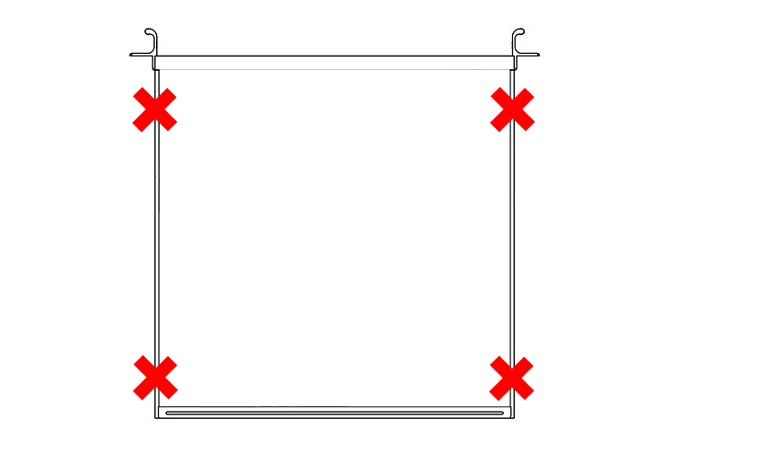

Verify Sealed Hardware
======================

Your NetHSM has been delivered in a sealed packaging. To verify that your NetSHM has arrived safely you should check the packaging for any tears, cuts, holes or broken sealings. Further on there is a unique handmade glitter seal on top of the packaging. Last but not least we will send you a picture of it after packing. Please compare the picture to your packaged NetHSM. If you notice any changes please contact us to arrange further action.  

Here are some pictures of how we wrap up a NetHSM:

Hardware Sealing

.. figure:: ./images/sealing.jpg
 :scale: 20
 :alt: seal
 
Position of the four Sealings

 
Front Side

.. figure:: ./images/front-side.jpg
  :scale: 20
  :alt: front side
 
Back Side

.. figure:: ./images/back-side.jpg
  :alt: back side
  :scale: 20
 
Buttom Side

.. figure:: ./images/buttom-side.jpg
  :alt: buttom side
  :scale: 20
 
Top Side
 
.. figure:: ./images/top-side.jpg
  :alt: top side
  :scale: 20
 
Left Side
 
