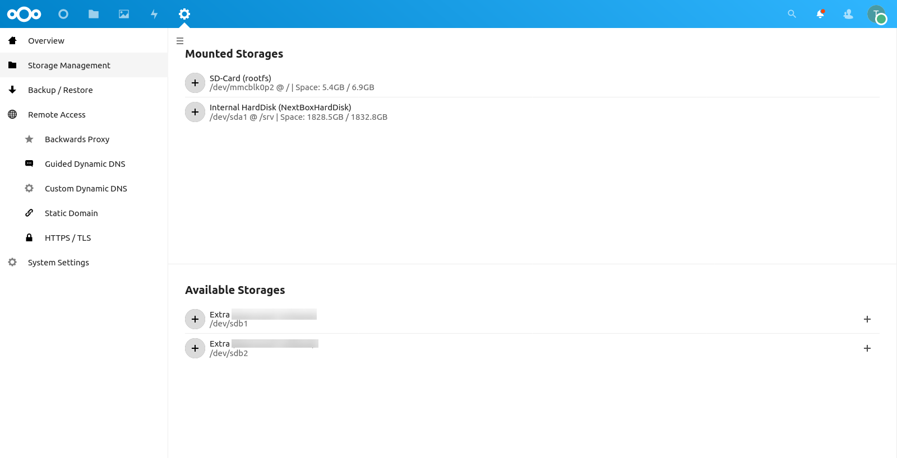
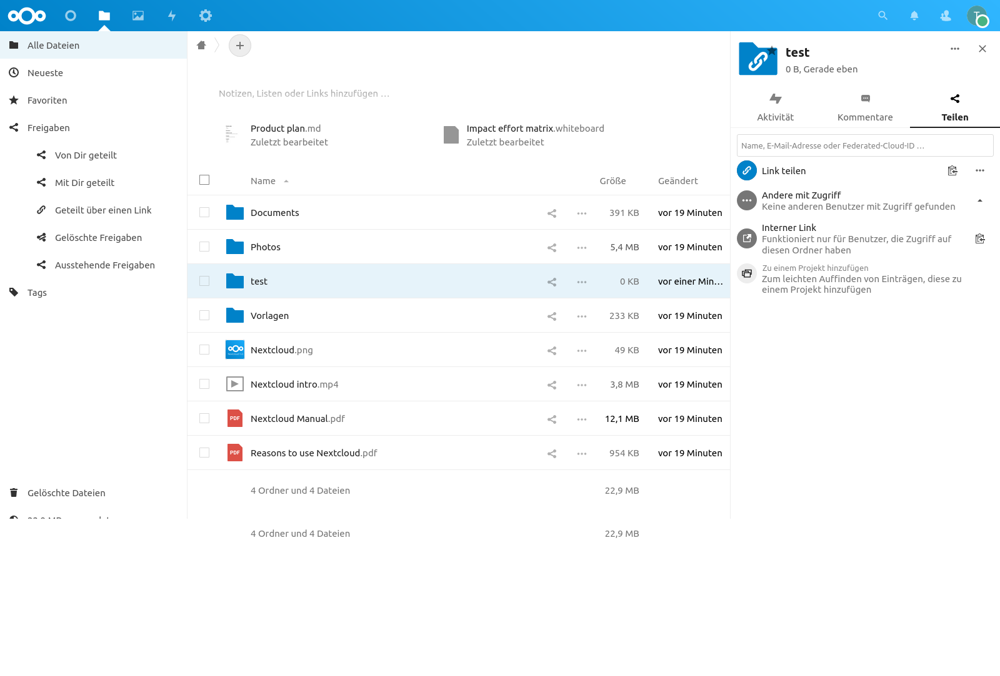

Connect External Storage
========================

.. Warning::

   External storage drives without an external power supply must NOT be
   connected to the USB sockets. Otherwise, this can lead to data loss on the
   internal hard disk. **Always use external storage drives with a separate
   power supply together with the NextBox.**

Requirements
------------

- an external storage drive with a separate power supply
- the external storage must be formatted with a supported filesystem (e.g. ext3, ext4 or XFS)

Configuration
-------------

- Connect your external storage to your NextBox
- Switch to the NextBox Administration App
- Select "Storage Management"
- Click onto the plus sign to mount the storage

.. note::

    If you want to share directories with multiple users you have to install the "Group folders app" and click
    onto the three dotted symbol and "Share" to make it available for other users. (As the last image shows)

.. figure:: ./images/storage-one.png
   :alt: Storage Configuration

