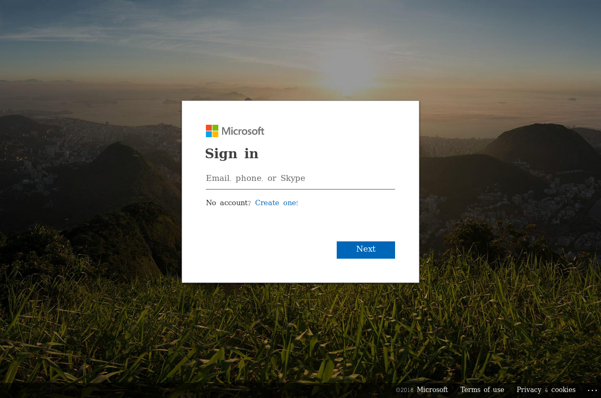
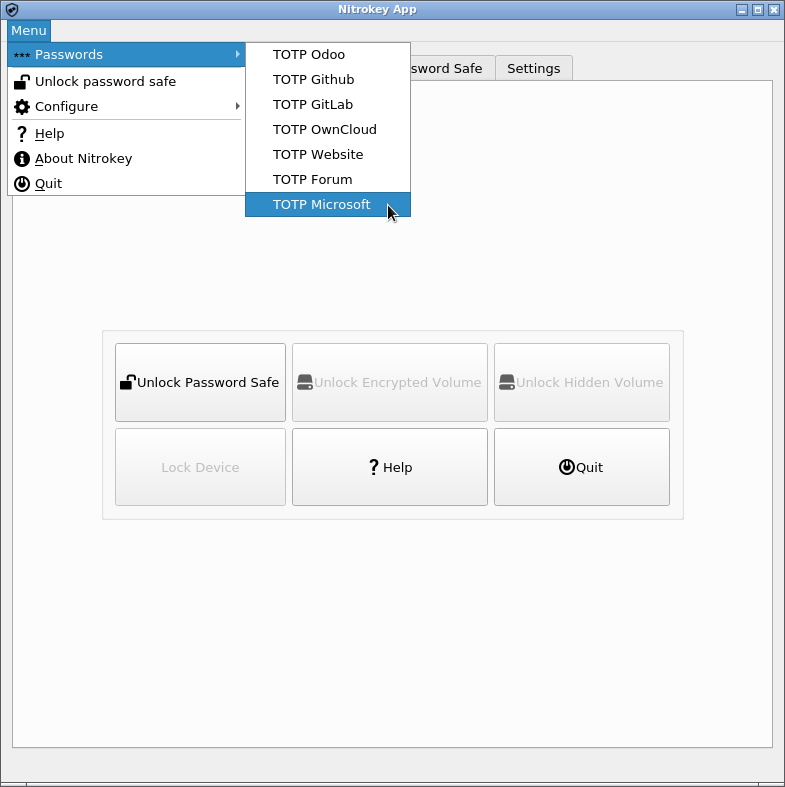

Two-factor Authentication for Microsoft Account
===============================================

.. contents:: :local:

These are the basic steps for registering the Nitrokey Pro or Nitrokey Storage as a second factor of a Microsoft account.

Visit https://account.live.com/proofs/Manage/additional and log in to your Microsoft account if prompted.

.. figure:: images/microsoft/2.png
   :alt: img2

Click on “Set up two-step verification”.

.. figure:: images/microsoft/3.png
   :alt: img3

Click on “Next”.

.. figure:: images/microsoft/4.png
   :alt: img4

Now it is important to click on “set up a different Authenticator app”.

.. figure:: images/microsoft/5.png
   :alt: img5

Click on “I can’t scan the bar code”.

.. figure:: images/microsoft/6.png
   :alt: img6

Insert and save secret code into the Nitrokey App.

.. figure:: images/microsoft/7.png
   :alt: img7

.. figure:: images/microsoft/8.png
   :alt: img8

.. figure:: images/microsoft/9.png
   :alt: img9

Enter code generated by Nitrokey App to confirm.

.. figure:: images/microsoft/11.png
   :alt: img11

Click “Next” and then “Finish”.

.. figure:: images/microsoft/12.png
   :alt: img12

.. figure:: images/microsoft/13.png
   :alt: img13

From now on, when signing in you need an OTP additionally to your password.

.. figure:: images/microsoft/14.png
   :alt: img14

