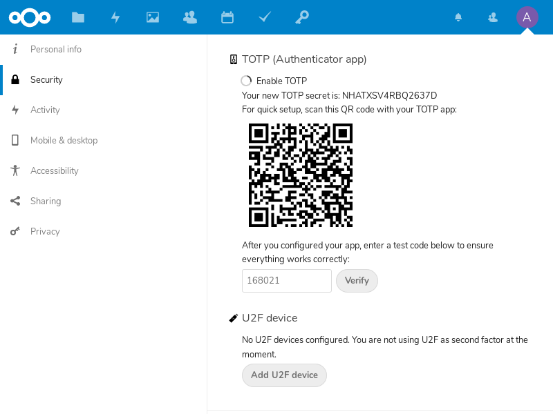

Two-factor Authentication for Nextcloud accounts
================================================

.. contents:: :local:

These are the basic steps for registering the Nitrokey Pro or Nitrokey Storage as a second factor of a Nextcloud account.

At first, log in to your Nextcloud account, click on the top right symbol of your account and open the settings menu.

.. figure:: images/nextcloud/1.png
   :alt: img1

Now choose “Security” on the left hand side.

.. figure:: images/nextcloud/2.png
   :alt: img2

Now you can tick the box reading “Enable TOTP”. There is shown the TOTP secret which we need to add to our Nitrokey via the Nitrokey App.

.. figure:: images/nextcloud/3.png
   :alt: img3

Copy and save secret code into the Nitrokey App.

.. figure:: images/nextcloud/4.png
   :alt: img4

.. figure:: images/nextcloud/5.png
   :alt: img5

Now we request a one-time password for the Nextcloud to verify the process by inserting the password on the website and pressing “verify”.

.. figure:: images/nextcloud/6.png
   :alt: img6

From now on, when signing in you need an OTP additionally to your password. Get one by the Nitrokey App like before and insert it in when logging in.

.. figure:: images/nextcloud/8.png
   :alt: img8

Nextcloud provides you with backup codes, in case you lost your Nitrokey. It is recommended to print out these codes and store them somewhere save otherwise you might not be able to log in to your account anymore!

.. figure:: images/nextcloud/9.png
   :alt: img9

