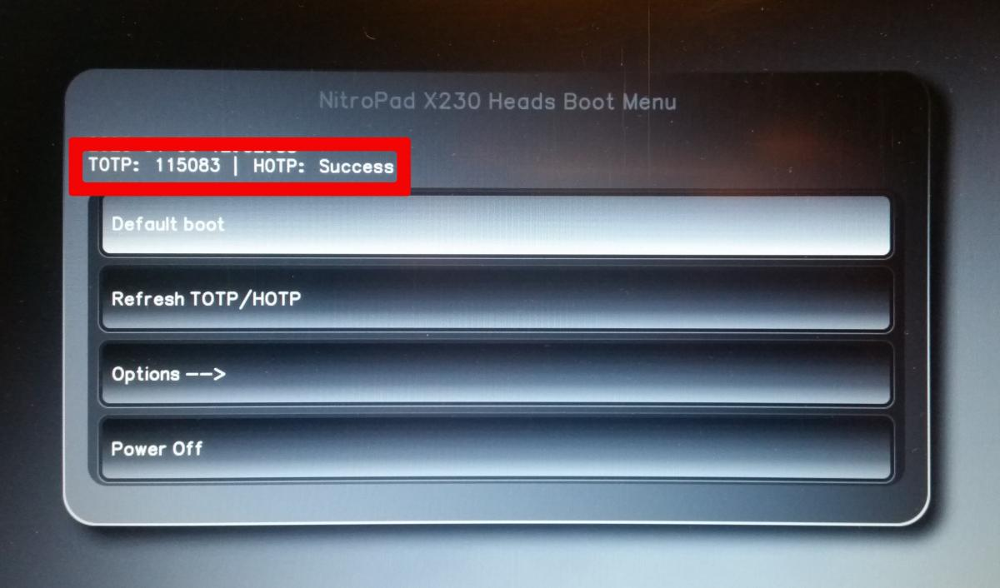

.. contents:: :local:

.. toctree::
   :maxdepth: 1
   :glob:
   :hidden:

   *

With the NitroPad, malicious changes to the BIOS, operating system,
and software can be easily detected. For example, if you left your
NitroPad in a hotel room, you can use your Nitrokey to check if it has
been tampered with while you were away. If an attacker modifies the
NitroPad’s firmware or operating system, the Nitrokey will detect this
(instructions below).

Verification of Sealed Hardware
-------------------------------

If you have ordered the unit with the option “sealed screws and sealed
bag”, please `verify the sealing <../sealed-hardware.html>`_ before
unpacking. If you do not know what this means, skip this section.

Secure Starting Procedure
-------------------------

With the NitroPad, malicious changes to the BIOS, operating system,
and software can be easily detected. For example, if you left your
NitroPad in a hotel room, you can use your Nitrokey to check if it has
been tampered with while you were away. If an attacker modifies the
NitroPad’s firmware or operating system, the Nitrokey will detect this
(instructions below).

Each time you start the NitroPad, you should - if possible - connect
your Nitrokey. If the Nitrokey is plugged in and the system has not been
modified, the following screen will appear when the NitroPad is turned
on.

The box marked in red contains the information that the BIOS has not
been changed and that the shared secret of the NitroPad and the Nitrokey
match. But this information is not sufficient, because an attacker could
have faked it. If at the same time the Nitrokey also flashes green,
everything is fine. An attacker would have to have had access to the
NitroPad and Nitrokey to achieve this result. It is therefore important
that you do not leave both devices unattended.

If the information on the NitroPad does not match the information on the
Nitrokey, the background would turn red and the message “Invalid Code”
would appear. This could indicate that manipulation has taken place.

.. figure:: ../images/NitroPad-boot-process-bad.jpeg
   :alt: img2

How the boot process may look like if the system has been changed (for
example after an update) and what error messages may otherwise occur is
described further below.

.. tip::

   The NitroPad can also be started without the Nitrokey. If you
   don’t have the Nitrokey with you, but are sure that the hardware has
   not been manipulated, you can boot your system without checking.