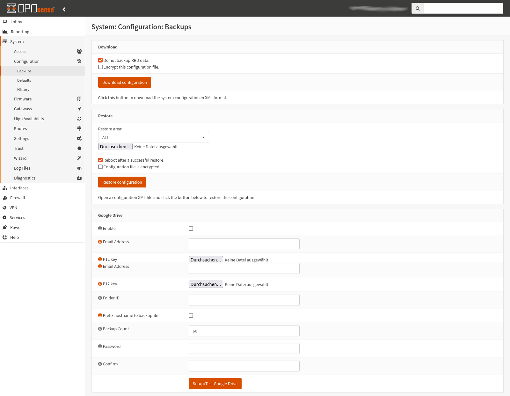

Backup & Restore
================

Before making any adjustments to the NitroWall configuration, you have the option of backing up the configuration and restoring it if necessary. How to do this is described in the following instructions:

1. Go to System -> Configuration -> Backups
2. In this menu you can perform the desired operations. You can restore specific areas of the configuration by selecting them via "Restore area".
3. If you can no longer access the web interface, it is also possible to perform the recovery via the command line interface. To do this, connect the NitroWall to a monitor and start it. After logging in, select item 13 "Restore a backup" and enter the number associated with the backup for the restore.

.. figure:: ./images/cli-restore.jpg
 :alt: cli restore
