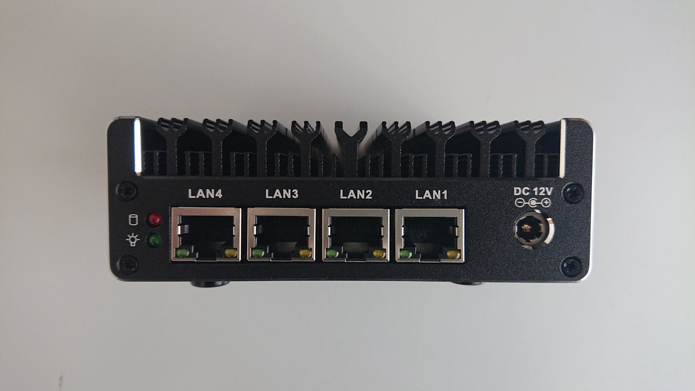

NitroWall
============================

Getting Started
---------------

.. warning:: Do **not** connect the NitroWall directly to your LAN as two DHCP servers will be actively distributing IPs within the network, confusing and disconnecting arbitrary devices in your network.

1. Connect the NitroWalls LAN1 port by a patch cable with the Ethernet port of your laptop or PC

.. important::
   Note that the standard configuration of OPNsense uses LAN2 as the WAN port and LAN1,3,4 as LAN ports. By default LAN3 and LAN4 are disabled. So you have to enable them (i.e. via bridging).

2. Connect the NitroWall with power supply
3. Turn on the NitroWall by I/O switch on the front side
4. After booting (the NitroWall beeps accordingly) it is available via https://192.168.1.1/.
   You'll get an IP address from NitroWalls DHCP-Server automatically

5. Confirm browser security warning
6. After logging in you are at the admin dashboard of the NitroWall

- Login: root
- Password: opnsense

7. Start the system wizard via the menu of the left-hand side: system →  system wizard → setup. The wizard is going through the configuration with you step-by-step.

 NitroWall back side

.. figure:: ./images/nitrowall_front.jpg
 :alt: NitroWall frontside

 NitroWall front side

.. figure:: ./images/dashboard.png
 :alt: dashboard

 NitroWall dashboard

.. figure:: ./images/reload.png
 :alt: reload

 Reload the NitroWall

8. After configuring your NitroWall reload it to make the changes persistent. As soon as the process terminates, you are back again at the dashboard.
9. After the installation is complete, install the necessary updates. To do this, go to System → Firmware → Updates.

.. toctree::
   :hidden:
   :maxdepth: 1
   :glob:
   
   firmware-update-nw678.rst
   sealed-hardware.rst
   backup-restore.rst
   dhcp.rst
   lan-bridge.rst
   ntp.rst
   ids-ips.rst
   hardware.rst
