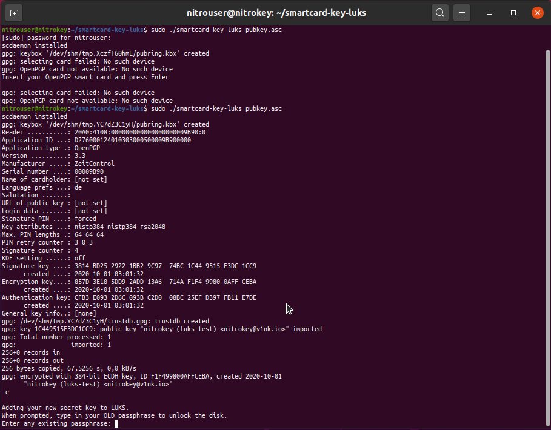

# Full-Disk Encryption with cryptsetup/LUKS

This guide shows how to configure LUKS-encrypted volumes, to authenticate at boot with [Nitrokey Pro](https://shop.nitrokey.com/shop/product/nk-pro-2-nitrokey-pro-2-3) or [Nitrokey Storage](https://shop.nitrokey.com/shop/product/nitrokey-storage-2-56).

To provide some background, cryptsetup-initramfs now has support for using OpenPGP smart cards like the Nitrokey Pro (or Nitrokey Storage) to unlock LUKS-encrypted volumes. Once you finish the setup, you will just need to insert your Nitrokey at boot and enter your User PIN, instead of typing in your regular disk encryption passphrase.

These instructions have been tested on Ubuntu 20.04 and Debian 10.

::: warning

The following guide can potentially lock you out of your computer. You should be aware of these risks, and we recommend you use the script below on a secondary computer, or after a full backup as you might lose your data.

:::

## Requirements

- An Ubuntu (or Debian) computer with at least one LUKS-encrypted volume. 

See the section below to detremine which method is compatible with this guide.

- A Nitrokey Pro 2 (or Nitrokey Storage) [initialized](https://www.nitrokey.com/documentation/openpgp-email-encryption) with keys. 

## Known Issues

So far, the script works only with manually-partitioned volumes, that are composed of an unencrypted `/boot` partition, and an encrypted root `/` partition.

Please do not select the automatic full-disk encryption provided by the operating system you are using for this guide. You will face recurrent errors when the partitioning is done automatically, using the installation interface on Ubuntu and Debian. 

## Instructions

1. Install dependencies

```bash

$ sudo apt install scdaemon opensc gnupg2

```
The pre-packaged version will install OpenSC version 0.19.0-1. If you wish to install and use the latest release, i.e. OpenSC 0.20, you can follow these [instructions](https://github.com/OpenSC/OpenSC/wiki/Compiling-and-Installing-on-Unix-flavors).

2. Create smartcard-luks directory

```bash

$ mkdir smartcard-luks && cd smartcard-luks

```
You might use `sudo` if required.

3. Download the smartcard-luks-script

//// Place the link to the script

//// Requires raw format to use wget otherwise install and use git clone

4. Export the public key

If you already have uploaded a public key to a keyserver (or have it stored somewhere else), you should retrieve it in the way you are most comfortable with, and proceed to step 5.

Optional: To generate another OpenPGP keypair on-device (Nitrokey), you can refer to the documentation mentioned above and [here](./openpgp-key-generation-on-device.html), as we will not cover these instructions in this guide. 

If you chose this method you can directly export your public keyby using the following command

```bash

$ gpg2 --armor --export KeyID > pubkey.asc

```
 Note that this instruction only works if you generated a new OpenPGP key on the Nitrokey, and on the same computer. See this [ticket](https://support.nitrokey.com/t/import-public-key-to-nitrokey-hsm/2021/5) for more information on the public key export. 

5. Execute the script with the pubkey.asc argument

```bash

$ sudo ./smartcard-luks-script pubkey.asc

```
Once, you run the script with the GPG public key as argument, it automatically sets up a new LUKS secret, encrypts it against that public key, and sets up crypttab, LUKS, initramfs, and GRUB.

First you will be prompted for the `User PIN`


Once you unlock the Nitrokey, you will be prompted for your `OLD passphrase`. It is the passphrase you entered to encrypt your volume at intallation. 



Notice: This is a fall-back alternative in case you lose your Nitrokey, or if it's unavailable. So far, it was not tested, and users must be aware of the risk of getting locked out of their computer, if the fall-back method does not work.

Once you enter the passphrase, the script finishes the setup. It took less than a minute of computation on our setup before it was done, so be aware of not interrupting the script, or you might get locked out of your computer after reboot.  


Done!

By now you must reboot, and you should be able to use your Nitrokey to unlock your encrypted drive.

## Usage

After reboot you should be prompted for your User PIN


Enter your User PIN to unlock the drive


