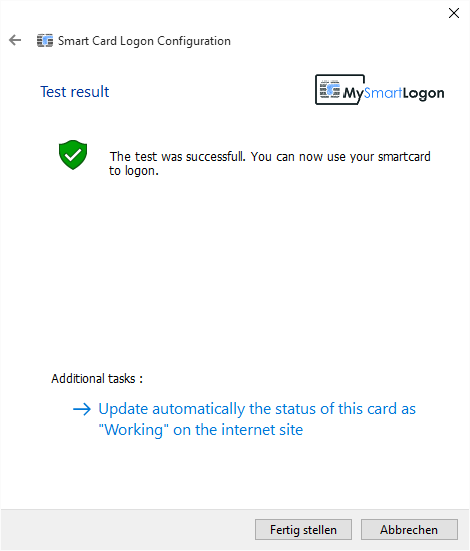

# Login With EIDAuthenticate on Stand Alone Windows Computers

1. Download and install the latest version of [OpenSC](https://github.com/OpenSC/OpenSC/wiki). Please install the [OpenPGP-CSP](https://github.com/vletoux/OpenPGP-CSP/releases/tag/1.3) driver **instead** if using Nitrokey Storage **2** or Nitrokey Pro **2**.
2. Download and install [EIDAuthenticate](https://www.mysmartlogon.com/eidauthenticate/). Note: The free community edition is disabled. You may test the enterprise edition instead.
3. Start EIDConfigurationWizard.exe
4. Select "Associate a new certificate"

5. Select or generate a Certificate Authority which should issue the user's certificate on the Nitrokey.

6. Enter the user PIN which you defined previously in step 4. Wait a moment until a new keypair and certificate are generated.
In case your Nitrokey is not detected you may want to execute "certutil -scinfo" for troubleshooting.

7. Select the newly generated certificate and press continue.

8. All checks should succeed. Press continue.

9. Enter the password of your user account.

10. Enter the user PIN which you defined previously in step 4.

11. The final screen may look like this.

You may perform further configurations such as activate the force smart card policy or automatically lock the computer when removing the Nitrokey (by using EIDConfigurationWizardElevated.exe).

From now on, when logging on to your Windows computer you need to connect the Nitrokey and enter your PIN.

