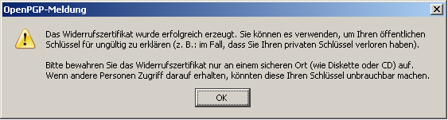

# OpenPGP Email Encryption With Thunderbird 78.3.2

At the moment Thunderbird's 78 support for the OpenPGP emails is not easy to set up. See Thunderbird's documentation for details:
- https://wiki.mozilla.org/Thunderbird:OpenPGP:Smartcards

Please use Kleopatra or GPA software to handle the smart card.

# OpenPGP Email Encryption With Thunderbird 77 and older

## Installation

1. Install the device driver as described [here](https://www.nitrokey.com/documentation/installation).

2. Install [Thunderbird](https://www.thunderbird.net/en-US/) and the Add-on [Enigmail](https://www.enigmail.net/index.php/en/).

## Changing PINs

There are two PINs for the Nitrokey:

- The User PIN required for daily work

- The Admin PIN is required to change keys or other settings of the device. In addition, the Nitrokey can be unlocked (for example, after 3 times incorrect input of the User PIN) by means of the Admin PIN.

After receiving the Nitrokey, you should immediately change the User PIN = "123456" and Admin PIN = "12345678".

## Procedure

1. Insert the Nitrokey into a USB port on your computer.

2. Start Thunderbird.

3. In Thunderbird, select as shown in the following picture. "OpenPGP" → "Manage smart card"

       

4. In the "SmartCard Details" window, select "SmartCard → Change PIN"

5. Select "Change PIN". This is your User PIN you need for daily work. Enter the current PIN ( "123456" for delivery) and twice your new PIN. For this PIN you can use the characters: a-z A-Z 0-9 / .;;:- !? () [] {}% +. The PIN should be at least 6 characters long. Click "OK".

6. Repeat the procedure for the Admin PIN. "SmartCard → Change PIN"

     

7. Select Change Admin PIN. This is your Admin PIN that you only rarely need. Enter the current PIN ( "12345678" for delivery) and the new PIN twice. For this PIN, you can use the characters: a-z A-Z 0-9 / .;;:- !? () [] {}% +. The PIN should be at least 8 characters long. Click "OK".

You have now changed the PINs and should continue to generate your personal keys.

## Generation of Keys

To encrypt data and e-mails, a key pair consisting of a public key and a private key, must first be generated. The so-called public key is used to **en**crypt the data or e-mails. You can distribute this to all those with whom you want to communicate securely (for example, publish it publicly on your site). The so-called private key is used to **de**crypt the data or messages. This key should **NEVER** be made known! Usually, you also do not have direct access to it (see below), since this is stored securely on the Nitrokey. Use the Nitrokey to create both keys using the following procedure:

1. Insert the Nitrokey into a USB port on your computer.
    StartThunderbird

2. In Thunderbird, select as shown in the following picture
    „OpenPGP“ → „Manage Smart Card“

3. In the "SmartCard details" window, select "SmartCard" → "Generate key"

4. In the following window, select your e-mail address for which you want to generate keys. Verify that the e-mail address specified in "User ID" is correct. You can also specify whether a private key backup copy should be stored on your computer.

5. If you do not create a backup copy, you have no chance to get your encrypted data if the Nitrokey is lost or damaged!

6. It is recommended to store this safety device. Select "Save key copy of the key outside the Smard Card". Then enter your personal password for the backup copy under "Passphrase". This password should not be less than 8 characters, and should contain both uppercase and lowercase letters and numbers. You can also use a long sentence, but avoid known prose or lyric. Also, no name or known term should be used.

**Allowed characters**: a-z A-Z 0-9 /.,;:-!?( )[ ]{}%+ (keine Umlaute ä,ü,ö,Ä,Ü,Ö oder ß)

**Poor Password**: qwertz123, IchliebeSusi3, Password, If you can dream it, you can do it.

**Strong Password**: g(Ak?2Pn7Yn oder Ki.stg2bLqzp%d or A dog with greeen Earz and fife legs (spelling errors increase security)

You do **not** need this password for daily work. It is only necessary for the restoration of the secret key, e.g. if you have lost the Nitrokey. Therefore, keep the password in a safe place.

You can also specify whether and when the key should be automatically invalid. This means, from this point onwards, no more e-mails can be encrypted with this key and you have to create a new key pair.

1. Finally, click on "Generate key pair".

   

2. You are now asked if the key should be generated. Confirm with "Yes".

     

3. In order for the program to write your keys to the stick, you must enter the admin PIN and the user PIN (changed above).

The key generation can take a few minutes. Do not terminate the program prematurely!

4. When the key generation is complete, you receive the following message. A certificate is now created that allows you to invalidate your key in an emergency. This certificate is automatically saved with your private key. This should be printed out or backed up on at least one other external medium so that you can revoke the validity of the keys if your keys and backups are lost.
Click "Yes"

You can now select the directory in which the backup copy is stored. This copy is encrypted with your password entered above. This means that no one can read or use the keys without your password. Do not give your password to anyone. This file with the name of your e-mail address and the suffix ".asc" should be backed up on another medium.
After selecting the directory, click "Save".

     

5. Here you must again specify your user PIN or passphrase.
Then click "OK"

     

7. You will now see the message that the certificate was created and saved.
Click "OK"

     

8. Key generation is now complete. You can now exit the program (File - Close).

Your Nitrokey is personalized and ready to use. **Have fun with the secure email encryption!**
