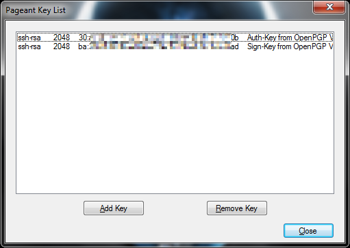

# PuTTY

This mini-howto assumes that the Nitrokey has been initialized and contains cryptographic keys.

**Required on the client side:**

- [PuTTY](http://www.chiark.greenend.org.uk/~sgtatham/putty/download.html) or a variant of it
- [GPG4Win](https://gpg4win.org/) or [pageant.exe](http://smartcard-auth.de/download-de.html) with Smartcard support from Dr. Peter Koch
- Optional: [OpenPGP Minidriver](http://wald.intevation.org/frs/?group_id=49&release_id=353)

**1) Pageant**

start pageant.exe. That this is running is shown in the notification area of the taskbar.

A double click opens the view of the current keys.

After inserting the key it looks like this.

If nothing is displayed here, pageant may have to be restarted or another application is already using the stick. A possibly running pgp-agent must be terminated! Now we only need the public key we want to store in the ssh configuration of the server. Therefore we press CTRL while inserting the stick...

and then view the Pageant-PublicKeys.txt.

I searched for the ssh-rsa entry of the auth key and added the line on the server to the authorized_keys.

**2) PuTTY**

There is surprisingly little to say about PuTTY itself.

"Attempt authentication using Pageant" must be set, which is the default anyway.

That's it, as soon as you connect to the server while pageant is running and you have the keys, you will be asked for the password of the Crypto-Stick and can log in.

**3) openpgp-minidriver (optional)**

If you are annoyed that Windows reports every time you plug in the stick that no driver could be found for "Smartcard", you can get rid of it. You just have to install the x86 or x64 version of the above mentioned driver and the smartcard looks like this:

