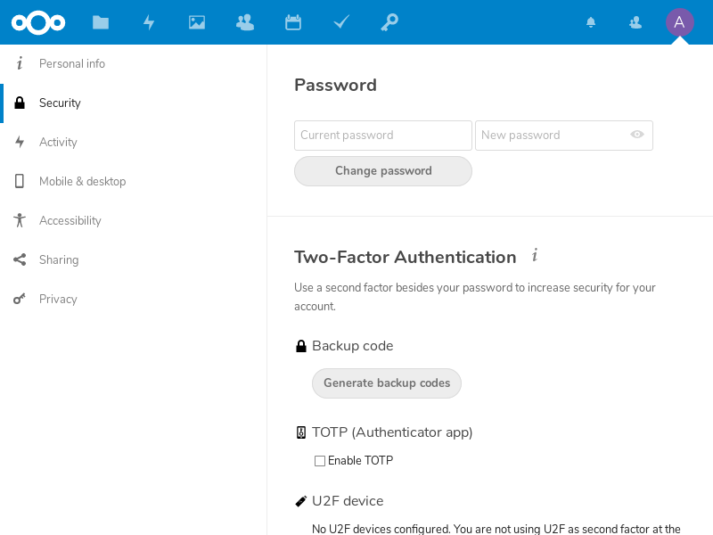

# Two-factor Authentication for Nextcloud accounts

These are the basic steps for registering the Nitrokey Pro or Nitrokey Storage as a second factor of a Nextcloud account.

At first, log in to your Nextcloud account, click on the top right symbol of your account and open the settings menu.

Now choose "Security" on the left hand side.

Now you can tick the box reading "Enable TOTP". There is shown the TOTP secret which we need to add to our Nitrokey via the Nitrokey App.

Copy and save secret code into the Nitrokey App.

Now we request a one-time password for the Nextcloud to verify the process by inserting the password on the website and pressing "verify".

 

 

From now on, when signing in you need an OTP additionally to your password. Get one by the Nitrokey App like before and insert it in when logging in.

 

Nextcloud provides you with backup codes, in case you lost your Nitrokey. It is recommended to print out these codes and store them somewhere save otherwise you might not be able to log in to your account anymore!

