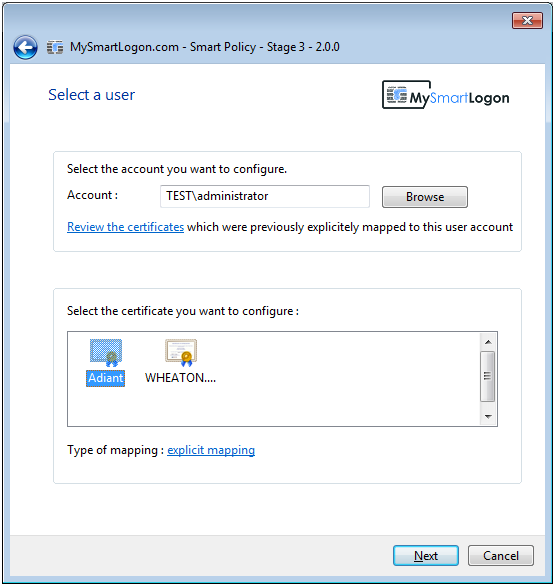

# Login With Nitrokey on Windows Domain Computers Using MS Active Directory


1. Download and install the latest [OpenSC](https://github.com/OpenSC/OpenSC/wiki).
2. Use a text editor to add the following settings to *C:\Program Files\OpenSC Project\OpenSC\opensc.conf*.

```
# Nitrokey Pro, OpenPGP Card
card_atr 3B:DA:18:FF:81:B1:FE:75:1F:03:00:31:C5:73:C0:01:40:00:90:00:0C {
	type = 9002;
	driver = "openpgp";
	# name = "Nitrokey Pro";
	md_read_only = false;
	md_supports_X509_enrollment = true;
}
     
# Nitrokey HSM, SmartCard-HSM
card_atr 3B:FE:18:00:00:81:31:FE:45:80:31:81:54:48:53:4D:31:73:80:21:40:81:07:FA {
	type = 26000;
	driver = "sc-hsm";
	# name = "Nitrokey HSM";
 	md_read_only = false;
	md_supports_X509_enrollment = true;
}
```

3. Open a command terminal and enter "regedit". Use regedit to import [this file](https://www.nitrokey.com/sites/default/files/nk-hsm.reg).
4. Now you can enroll Nitrokeys for your users managed in Microsoft Active Directory. You may either use Microsoft PKI, [gpgsm](https://www.gnupg.org/documentation/manuals/gnupg/Howto-Create-a-Server-Cert.html), or [Smart Policy](http://www.mysmartlogon.com/products/smart-policy.html). The following steps describe the usage of Smart Policy.
5. [Download](http://download.mysmartlogon.com/SmartPolicyv2/SmartPolicy%20-%20Stage%203.exe) and install Smart Policy.
6. Select "Read a smart card"


7. Select the certificate, mapping, and user.



8. Verify the device status via CRL.


9. Choose a Group Policy Object (GPO).


10. Confirm applying the mapping.


From now on, when logging on to your Windows computer you need to connect the Nitrokey and enter your PIN.


