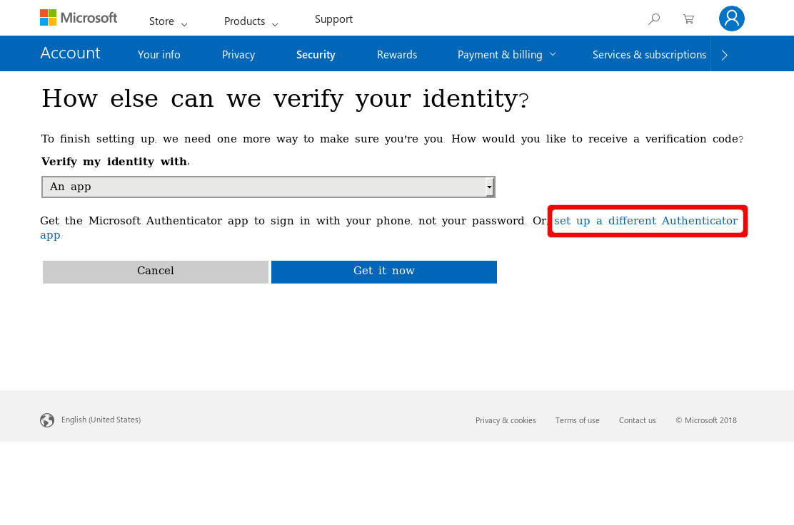
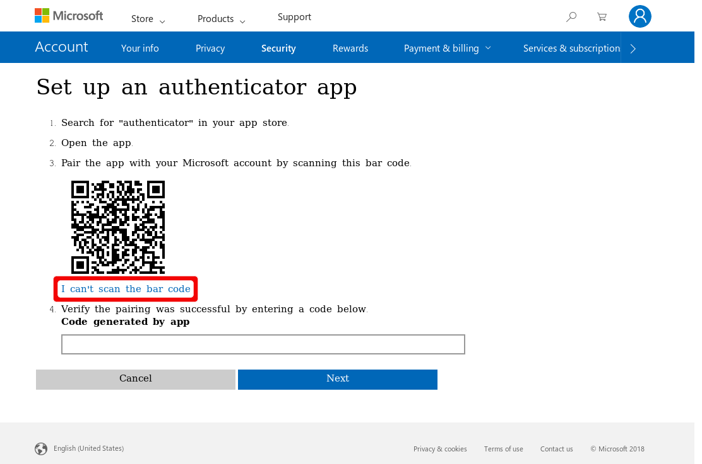
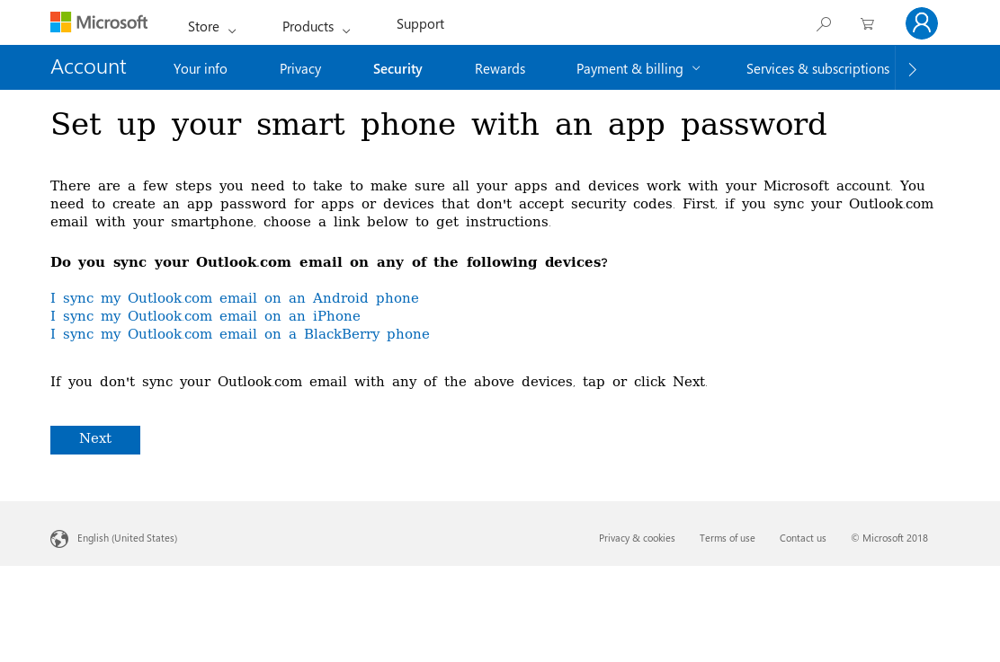

# Two-factor Authentication for Microsoft Account 

These are the basic steps for registering the Nitrokey Pro or Nitrokey Storage as a second factor of a Microsoft account.

Visit [https://account.live.com/proofs/Manage/additional](https://account.live.com/proofs/Manage/additional) and log in to your Microsoft account if prompted.

Click on "Set up two-step verification".

Click on "Next".

Now it is important to click on "set up a different Authenticator app".

Click on "I can't scan the bar code".

Insert and save secret code into the Nitrokey App.

Enter code generated by Nitrokey App to confirm.

Click "Next" and then "Finish".

From now on, when signing in you need an OTP additionally to your password.

