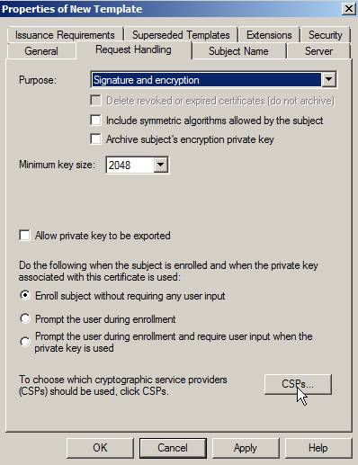
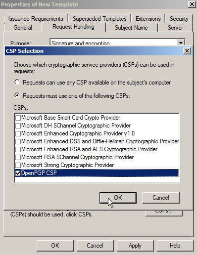
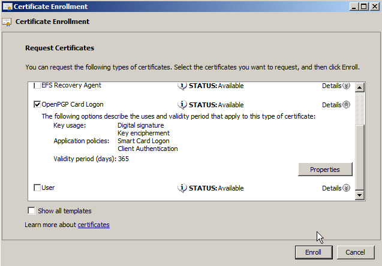
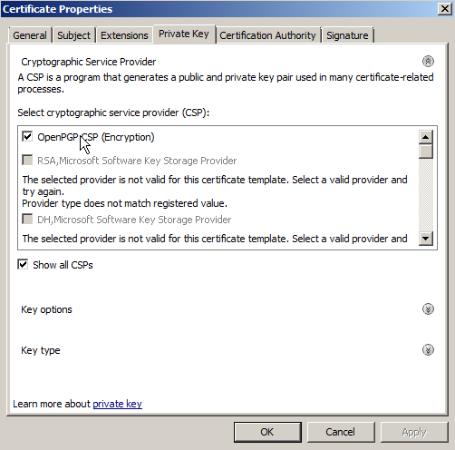

# Windows Logon and S/MIME Email Encryption with Active Directory

Please note that this driver is still in development/testing. Please tell us your experiences! See our [contact page](https://www.nitrokey.com/contact).

## Prerequisites

This guide assumes that an Active Directory server with role 'Active Directory Certificate Services' is installed and running on a server. These instructions are based on Nitrokey Storage 2 and Nitrokey Pro 2 only.

## Installing OpenPGP-CSP

This step is needed for clients to use the OpenPGP-CSP driver. Download and install the [latest version](https://github.com/vletoux/OpenPGP-CSP/releases/tag/1.3) of the installer file 'SetupOpenPGPCsp' for your system architecture, for 'SetupOpenPGPCsp_x64.msi' for 64-bit systems.

You may want to install the driver on the server as well for being able to enforce the use of this driver in the template (see below).

## Creating Certificate Template on Server Side

On Active Directory Server open certsrv.msc to manage your certificate templates. Right click on 'Certificate Templates' and choose 'Manage'

Now right click on 'Smartcard Logon' template and click 'Duplicate', to create a new template on basis of this standard template. Rename template to 'OpenPGP Card Logon and Email' or alike.

Under 'Request Handling', you can choose the OpenPGP-CSP as the one and only Cryptography Service Provider (click the Button labeled 'CSPs...'). For this to work, you need to install the driver on the server as well and you have to insert a Nitrokey beforehand. This is optional. You can let the user choose, which CSP to use.

For enabling S/MIME email encryption go to 'Subject name'. Tick the checkbox 'E-Mail name' (note: You must save the mail addresses of your users in the corresponding Active Directory field!).

Then go to 'Extensions', there you edit the applications guideline and add 'Secure Email'.

## Request Certificate on Client (Domain Member)

To request a certificate for a domain member, you have to open certmgr.msc. Right click on folder 'Personal->Certificates' and click 'All Tasks->Request New Certificate and choose the template you created on the AD.

If you did not enforce the usage of OpenPGP-CSP you have to choose it here now.

Next you choose the Authentication slot for the certificate.

You are now ready to logon on the computer with the Nitrokey instead of your password and you can use [S/MIME email encryption/signing](https://www.nitrokey.com/documentation/smime-email-encryption) with the Nitrokey. The driver has to be installed on every computer you want to use the certificate on.

