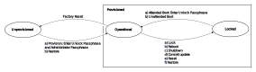

Administration
==============

This chapter describes administrative tasks for users with the *Administrator* role.
Please refer to chapter `Roles <administration#roles>`__ to learn more about the role.

.. important::
   Please make sure you read the information in the beginning of `this document <index.html>`__ before starting to work.

System Management
-----------------

Device Information
~~~~~~~~~~~~~~~~~~

The vendor and product information for a NetHSM can be retrieved as follows.

.. tabs::
   .. tab:: nitropy
      **Example**

      .. code-block:: bash

         $ nitropy nethsm --host $NETHSM_HOST info

      .. code-block::

         Host:    localhost:8443
         Vendor:  Nitrokey GmbH
         Product: NetHSM

   .. tab:: REST API
      Information about the `/info` endpoint can be found in the `API documentation <https://nethsmdemo.nitrokey.com/api_docs/index.html#/default/GET_info>`__.

Boot Mode
~~~~~~~~~

NetHSM can be used in *Attended Boot* mode and *Unattended Boot* mode.

+-------------------+----------------------------------------------------------------------+
| Boot Mode         | Description                                                          |
+===================+======================================================================+
| *Attended Boot*   | The NetHSM boots up into a _Locked_ state. The *Unlock Passphrase*   |
|                   | needs to be entered during each start, which is used to decrypt the  |
|                   | *User Data*. For security reasons, this mode is recommended and it's |
|                   | the default mode for a freshly provisioned system.                   |
+-------------------+----------------------------------------------------------------------+
| *Unattended Boot* | The system starts unattended without the need to enter the *Unlock*  |
|                   | *Passphrase* into an _Operational_ state.                            |
|                   | Use this mode if your availability requirements can not be fulfilled |
|                   | with *Attended Boot* mode.                                           |
+-------------------+----------------------------------------------------------------------+

.. warning::
   Regardless of the boot mode, the *Unlock Passphrase* retains its validity and is required for restoring backups on other hardware. Keep the *Unlock Passphrase* safe at any time.

The current boot mode can be retrieved as follows.

.. tabs::
   .. tab:: nitropy
      **Example**

      .. code-block:: bash

         $ nitropy nethsm --host $NETHSM_HOST get-config --unattended-boot

      .. code-block::

         Configuration for NetHSM localhost:8443:
            Unattended boot: off
   .. tab:: REST API
      Information about the `/config/unattended-boot` endpoint can be found in the `API documentation <https://nethsmdemo.nitrokey.com/api_docs/index.html#/default/GET_config-unattended-boot>`__.

The boot mode can be changed as follows. At next boot, the NetHSM will behave accordingly.

.. tabs::
   .. tab:: nitropy
      **Arguments**

      +----------+--------------------------------------+
      | Argument | Description                          |
      +==========+======================================+
      | Status   | Enable or disable *Unattended Boot*. |
      |          | Can have value ``on`` or ``off``.    |
      +----------+--------------------------------------+

      **Example**

      .. code-block:: bash

         $ nitropy nethsm --host $NETHSM_HOST set-unattended-boot on

      .. code-block::

         Updated the unattended boot configuration for NetHSM localhost:8443
   .. tab:: REST API
      Information about the `/config/unattended-boot` endpoint can be found in the `API documentation <https://nethsmdemo.nitrokey.com/api_docs/index.html#/default/PUT_config-unattended-boot>`__.

State
~~~~~

The NetHSM software has four states: *Unprovisioned*, *Provisioned*, *Locked*, and *Operational*.

+-----------------+-------------------------------------------------------------------------+
| State           | Description                                                             |
+=================+=========================================================================+
| *Unprovisioned* | NetHSM without configuration (factory default)                          |
+-----------------+-------------------------------------------------------------------------+
| *Provisioned*   | NetHSM with configuration.                                              |
|                 | The *Provisioned* state implies either *Operational* or *Locked* state. |
+-----------------+-------------------------------------------------------------------------+
| *Operational*   | NetHSM with configuration and ready to execute commands.                |
|                 | The *Operational* state implies the *Provisioned* state.                |
+-----------------+-------------------------------------------------------------------------+
| *Locked*        | NetHSM with configuration but encrypted and inaccessible data stores.   |
|                 | Typically, the next step is to unlock the system. The *Locked* state    |
|                 | implies the *Provisioned* state.                                        |
+-----------------+-------------------------------------------------------------------------+

      States and transitions of the NetHSM

      |

The current state of the NetHSM can be retrieved as follows.

.. tabs::
   .. tab:: nitropy
      **Example**

      .. code-block:: bash

         $ nitropy nethsm --host $NETHSM_HOST state

      .. code-block::

         NetHSM localhost:8443 is Unprovisioned
   .. tab:: REST API
      Information about the `/health/state` endpoint can be found in the `API documentation <https://nethsmdemo.nitrokey.com/api_docs/index.html#/default/GET_health-state>`__.

A new NetHSM has an *Unprovisioned* state and after provisioning enters the *Operational* state.
The provisioning of a NetHSM is described in the chapter `Provisioning <getting-started#provisioning>`__.

A NetHSM in *Operational* state can be locked again to protect it as follows.

.. tabs::
   .. tab:: nitropy
      **Example**

      .. code-block:: bash

         $ nitropy nethsm --host $NETHSM_HOST lock

      .. code-block::

         NetHSM localhost:8443 locked
   .. tab:: REST API
      Information about the `/lock` endpoint can be found in the `API documentation <https://nethsmdemo.nitrokey.com/api_docs/index.html#/default/POST_lock>`__.

A NetHSM in *Locked* state can be unlocked as follows. While the NetHSM is in the _Locked_ state no other operations are possible. Afterwards the NetHSM is in an _Operational_ state.

.. tabs::
   .. tab:: nitropy
      **Example**

      .. code-block:: bash

         $ nitropy nethsm --host $NETHSM_HOST unlock

      .. code-block::

         NetHSM localhost:8443 unlocked
   .. tab:: REST API
      Information about the `/unlock` endpoint can be found in the `API documentation <https://nethsmdemo.nitrokey.com/api_docs/index.html#/default/POST_unlock>`__.

Unlock Passphrase
~~~~~~~~~~~~~~~~~

The *Unlock Passphrase* is used to derive an *Unlock Key* if the NetHSM is in *Locked* state.
The passphrase is initially set during provisioning of the NetHSM.

.. warning::
   The unlock passphrase cannot be reset without knowing the current value.
   If the unlock passphrase is lost, neither can it be reset to a new value nor can the NetHSM be unlocked.

The *Unlock Passphrase* can be set as follows.

.. tabs::
   .. tab:: nitropy
      **Optional Options**

      +-------------------------------------------+---------------------------------------------+
      | Option                                    | Description                                 |
      +===========================================+=============================================+
      | ``-n``, ``--new-passphrase`` ``TEXT``     | The new unlock passphrase                   |
      +-------------------------------------------+---------------------------------------------+
      | ``-p``, ``--current-passphrase`` ``TEXT`` | The current unlock passphrase               |
      +-------------------------------------------+---------------------------------------------+
      | ``-f``, ``--force``                       | Do not ask for confirmation before changing |
      |                                           | the passphrase                              |
      +-------------------------------------------+---------------------------------------------+

      **Example**

      .. code-block:: bash

         $ nitropy nethsm --host $NETHSM_HOST set-unlock-passphrase

      .. code-block::

         New passphrase: 
         Repeat for confirmation: 
         Current passphrase: 
         Warning: The unlock passphrase cannot be reset without knowing the current value. If the unlock passphrase is lost, neither can it be reset to a new value nor can the NetHSM be unlocked.
         Do you want to continue? [y/N]: y
         Updated the unlock passphrase for NetHSM localhost:8443
   .. tab:: REST API
      Information about the `/config/unlock-passphrase` endpoint can be found in the `API documentation <https://nethsmdemo.nitrokey.com/api_docs/index.html#/default/PUT_config-unlock-passphrase>`__.

TLS Certificate
~~~~~~~~~~~~~~~

The TLS certificate is used for the HTTPS based REST API, and thus also used by *nitropy*.
During provisioning a self-signed certificate is created.
The certificate can be replaced, for example with a signed certificate from a certificate authority (CA).
In this case a Certificate Signing Request (CSR) must be generated.
After signing the certificate must be imported to the NetHSM.

A change is only necessary when the certificate is to be replace.
Such change may be to replace it with a signed certificate from a certificate authority (CA).

The TLS certificate can be retrieved as follows.

.. tabs::
   .. tab:: nitropy
      **Required Options**

      +-------------------+--------------------------------------------------+
      | Option            | Description                                      |
      +===================+==================================================+
      | ``-a``, ``--api`` | Get the certificate for the NetHSM TLS interface |
      +-------------------+--------------------------------------------------+

      **Example**

      .. code-block:: bash

         $ nitropy nethsm --host $NETHSM_HOST get-certificate --api
        
      .. code-block::

         -----BEGIN CERTIFICATE-----
         MIIBHzCBxaADAgECAgkA7AznVQK3XWkwCgYIKoZIzj0EAwIwFDESMBAGA1UEAwwJ
         a2V5ZmVuZGVyMCAXDTcwMDEwMTAwMDAwMFoYDzk5OTkxMjMxMjM1OTU5WjAUMRIw
         EAYDVQQDDAlrZXlmZW5kZXIwWTATBgcqhkjOPQIBBggqhkjOPQMBBwNCAARbeCRl
         F1ZIjK1bTfrPvtCoYDThMjdV1q8mq+B9FMDo4GIahTCUG/Ub6bCOcbip5pP92J3h
         yMEcPuos72c1KcGjMAoGCCqGSM49BAMCA0kAMEYCIQC/BNrkCM5gpsVfa9EqQcM0
         PCaADyZG7KKLgDv7asa5LwIhAKDXRE3Tdm9tYObO0X4p0CRQkl1+DnvGljzQe34C
         JBax
         -----END CERTIFICATE-----
   .. tab:: REST API
      Information about the `/config/tls/cert.pem` endpoint can be found in the `API documentation <https://nethsmdemo.nitrokey.com/api_docs/index.html#/default/GET_config-tls-cert-pem>`__.

The TLS certificate can be generated as follows.

.. tabs::
   .. tab:: nitropy
      **Required Options**

      +-------------------------------------------------------------------------+---------------------------------+
      | Option                                                                  | Description                     |
      +=========================================================================+=================================+
      | ``-t``, ``--type`` ``[RSA|Curve25519|EC_P224|EC_P256|EC_P384|EC_P521]`` | The type for the generated key  |
      +-------------------------------------------------------------------------+---------------------------------+
      | ``-l``, ``--length`` ``INTEGER``                                        | The length of the generated key |
      +-------------------------------------------------------------------------+---------------------------------+

      **Example**

      .. code-block:: bash

         $ nitropy nethsm --host $NETHSM_HOST generate-tls-key -t Curve25519

      .. code-block::

         Key for TLS interface generated on NetHSM localhost:8443
   .. tab:: REST API
      Information about the `/config/tls/generate` endpoint can be found in the `API documentation <https://nethsmdemo.nitrokey.com/api_docs/index.html#/default/POST_config-tls-generate>`__.

The Certificate Signing Request (CSR) for the certificate can be generated as follows.

.. tabs::
   .. tab:: nitropy
      **Required Options**

      +------------------------------------+-----------------------------------------------+
      | Option                             | Description                                   |
      +====================================+===============================================+
      | ``-a``, ``--api``                  | Generate a CSR for the NetHSM TLS certificate |
      +------------------------------------+-----------------------------------------------+
      | ``--country`` ``TEXT``             | The country name                              |
      +------------------------------------+-----------------------------------------------+
      | ``--state-or-province`` ``TEXT``   | The state or province name                    |
      +------------------------------------+-----------------------------------------------+
      | ``--locality`` ``TEXT``            | The locality name                             |
      +------------------------------------+-----------------------------------------------+
      | ``--organization`` ``TEXT``        | The organization name                         |
      +------------------------------------+-----------------------------------------------+
      | ``--organizational-unit`` ``TEXT`` | The organization unit name                    |
      +------------------------------------+-----------------------------------------------+
      | ``--common-name`` ``TEXT``         | The common name                               |
      +------------------------------------+-----------------------------------------------+
      | ``--email-address`` ``TEXT``       | The email address                             |
      +------------------------------------+-----------------------------------------------+

      **Example**

      .. code-block:: bash

         $ nitropy nethsm --host $NETHSM_HOST csr --api --country="DE" --state-or-province="Berlin" --locality="Berlin" --organization="Nitrokey" --organizational-unit="" --common-name="Nitrokey" --email-address="info@nitrokey.com"

      .. code-block::

         -----BEGIN CERTIFICATE REQUEST-----
         MIGBMDUCAQAwAjEAMCowBQYDK2VwAyEAE+nz+nOj80SWG25UbqVcQk6Ua84zuj5B
         9qCtPpDUX2qgADAFBgMrZXADQQDwk9LrYDu83a1jgBGqW0I9BVXWEhP4gZLxlVV+
         c102GFi963ZPIxG7Z5+uWplz+wr/Vmr7KLr6oM01M/AZPJQO
         -----END CERTIFICATE REQUEST-----
   .. tab:: REST API
      Information about the `/config/tls/csr.pem` endpoint can be found in the `API documentation <https://nethsmdemo.nitrokey.com/api_docs/index.html#/default/POST_config-tls-csr-pem>`__.

The certificate can be replaced as follows.

.. tabs::
   .. tab:: nitropy
      **Required Options**

      +-------------------+--------------------------------------------------+
      | Option            | Description                                      |
      +===================+==================================================+
      | ``-a``, ``--api`` | Set the certificate for the NetHSM TLS interface |
      +-------------------+--------------------------------------------------+
      
      **Arguments**

      +--------------+------------------+
      | Argument     | Description      |
      +==============+==================+
      | ``FILENAME`` | Certificate file |
      +--------------+------------------+

      **Example**
      
      .. code-block:: bash

         nitropy nethsm --host $NETHSM_HOST set-certificate --api /tmp/nethsm-certificate
   .. tab:: REST API
      Information about the `/config/tls/csr.pem` endpoint can be found in the `API documentation <https://nethsmdemo.nitrokey.com/api_docs/index.html#/default/PUT_config-tls-cert-pem>`__.

Network
~~~~~~~

The network configuration defines the settings used for the *Network Port*.

.. note::
   This settings do not configure the *BMC Network Port* on the NetHSM 1.

The network configuration can be retrieved as follows.

.. tabs::
   .. tab:: nitropy
      **Required Options**

      +---------------+---------------------------------+
      | Option        | Description                     |
      +===============+=================================+
      | ``--network`` | Query the network configuration |
      +---------------+---------------------------------+

      **Example**
      
      .. code-block:: bash

         $ nitropy nethsm -h $NETHSM_HOST get-config --network

      .. code-block::

         Configuration for NetHSM localhost:8443:
         Network:
               IP address:    192.168.1.1
               Netmask:       255.255.255.0
               Gateway:       0.0.0.0
   .. tab:: REST API
      Information about the `/config/network` endpoint can be found in the `API documentation <https://nethsmdemo.nitrokey.com/api_docs/index.html#/default/GET_config-network>`__.

Set the network configuration as follows.

.. note::
   The NetHSM does not support DHCP (Dynamic Host Configuration Protocol).

.. note::
   The NetHSM does not support IPv6 (Internet Protocol version 6).

.. tabs::
   .. tab:: nitropy
      **Required Options**

      +---------------------------+--------------------+
      | Option                    | Description        |
      +===========================+====================+
      | ``-a``, ``--ip-address``  | The new IP address |
      +---------------------------+--------------------+
      | ``-n``, ``--netmask``     | The new netmask    |
      +---------------------------+--------------------+
      | ``-g``, ``--gateway``     | The new gateway    |
      +---------------------------+--------------------+

      **Example**

      .. code-block:: bash

         $ nitropy nethsm -h $NETHSM_HOST set-network-config -a 192.168.1.1 -n 255.255.255.0 -g 0.0.0.0

      .. code-block::

         Updated the network configuration for NetHSM localhost:8443
   .. tab:: REST API
      Information about the `/config/network` endpoint can be found in the `API documentation <https://nethsmdemo.nitrokey.com/api_docs/index.html#/default/PUT_config-network>`__.

Time
~~~~

The time configuration sets the system time of the NetHSM software.
It is usually not required to set the system time, as it is set during provisioning.

The time configuration can be retrieved as follows.

.. tabs::
   .. tab:: nitropy
      **Required Options**

      +------------+-----------------------+
      | Option     | Description           |
      +============+=======================+
      | ``--time`` | Query the system time |
      +------------+-----------------------+

      **Example**

      .. code-block:: bash

         $ nitropy nethsm -host $NETHSM_HOST get-config --time

      .. code-block::

         Configuration for NetHSM localhost:8443:
         Time:            2022-08-17 11:40:00+00:00
   .. tab:: REST API
      Information about the `/config/time` endpoint can be found in the `API documentation <https://nethsmdemo.nitrokey.com/api_docs/index.html#/default/GET_config-time>`__.

Set the time of the NetHSM.

.. important::
   Make sure to pass the time in UTC timezone.

.. tabs::
   .. tab:: nitropy
      **Arguments**

      +----------+-------------------------------------------------------+
      | Argument | Description                                           |
      +==========+=======================================================+
      | ``time`` | The system time to set (Format: YYYY-MM-DDTHH:MM:SSZ) |
      +----------+-------------------------------------------------------+

      **Example**

      .. code-block:: bash

         $ nitropy nethsm -h $NETHSM_HOST set-time 2022-08-17T11:40:00Z

      .. code-block::

         Updated the system time for NetHSM localhost:8443
   .. tab:: REST API
      Information about the `/config/time` endpoint can be found in the `API documentation <https://nethsmdemo.nitrokey.com/api_docs/index.html#/default/PUT_config-time>`__.

Metrics
~~~~~~~

The NetHSM logs metrics of system parameters.
Please refer to `Metrics <metrics>`__ to learn more about each metric.

The metrics can be retrieved as follows.

.. tabs::
   .. tab:: nitropy
      **Required Role**

      This operation requires an authentication with the *Metrics* role.

      **Example**

      .. code-block:: bash

         $ nitropy nethsm -h $NETHSM_HOST metrics

      .. code-block::

         Metric                      	Value
         ----------------------------	--------
         client connections          	0
         established state           	6
         external.received bytes     	989931
         external.received packets   	13239
         external.transmitted bytes  	25908953
         external.transmitted packets	22037
         free chunk count            	322
         gc compactions              	0
         gc major bytes              	21348352
         gc major collections        	35
         gc minor collections        	2652
         http response 200           	28
         http response 201           	1
         http response 204           	1
         http response 400           	1
         http response 403           	1
         http response 404           	145
         http response 412           	1
         http response time          	0.084998
         http response total         	178
         internal.received bytes     	66541
         internal.received packets   	1130
         internal.transmitted bytes  	63802
         internal.transmitted packets	1133
         kv write                    	2
         log errors                  	3
         log warnings                	3
         maximum allocated space     	64528384
         maximum releasable bytes    	1216
         mmapped region count        	0
         new sleeper size            	1
         non-mmapped allocated bytes 	64528384
         sleep queue size            	11
         syn-rcvd state              	0
         timers                      	2
         total allocated space       	43940832
         total client                	1
         total established           	515
         total free space            	20587552
         total sleeper size          	12
         total syn-rcvd              	514
         total timers                	526
         uptime                      	17626
   .. tab:: REST API
      Information about the `/metrics` endpoint can be found in the `API documentation <https://nethsmdemo.nitrokey.com/api_docs/index.html#/default/GET_metrics>`__.

Logging
~~~~~~~

The NetHSM can log system events to the serial port or to a syslog server on the network.

.. important::
   For any production deployment, the NetHSM log should be monitored continuously to provide immediate notification of any potential security issues.

The syslog server configuration can be retrieved as follows.

.. tabs::
   .. tab:: nitropy
      **Required Options**

      +---------------+---------------------------------+
      | Option        | Description                     |
      +===============+=================================+
      | ``--logging`` | Query the logging configuration |
      +---------------+---------------------------------+

      **Example**

      .. code-block:: bash

         $ nitropy nethsm -h $NETHSM_HOST get-config --logging

      .. code-block::

         Logging:
            IP address:    0.0.0.0
            Port:          514
            Log level:     info
   .. tab:: REST API
      Information about the `/config/logging` endpoint can be found in the `API documentation <https://nethsmdemo.nitrokey.com/api_docs/index.html#/default/GET_config-logging>`__.

The syslog server configuration can be set as follows.

.. tabs::
   .. tab:: nitropy
      **Required Options**

      +--------------------------------------------------------+-----------------------------------------------+
      | Option                                                 | Description                                   |
      +========================================================+===============================================+
      | ``-a``, ``--ip-address`` ``TEXT``                      | The IP address of the new logging destination |
      +--------------------------------------------------------+-----------------------------------------------+
      | ``-p``, ``--port`` ``INTEGER``                         | The port of the new logging destination       |
      +--------------------------------------------------------+-----------------------------------------------+
      | ``-l``, ``--log-level`` ``[debug|info|warning|error]`` | The new log level                             |
      +--------------------------------------------------------+-----------------------------------------------+

      **Example**

      .. code-block:: bash

         $ nitropy nethsm -h $NETHSM_HOST set-logging-config -a 192.168.0.1 -p 514 -l info

      .. code-block::

         Updated the logging configuration for NetHSM localhost:8443
   .. tab:: REST API
      Information about the `/config/logging` endpoint can be found in the `API documentation <https://nethsmdemo.nitrokey.com/api_docs/index.html#/default/PUT_config-logging>`__.

The serial console works right from the start of the NetHSM hardware. It includes events from the NetHSM firmware and the NetHSM software.

The serial console connection settings are as follows.

+--------------+--------+
| Setting      | Value  |
+==============+========+
| Baud rate    | 115200 |
+--------------+--------+
| Data bits    | 8      |
+--------------+--------+
| Stop bits    | 1      |
+--------------+--------+
| Parity       | None   |
+--------------+--------+
| Flow Control | None   |
+--------------+--------+

Backup
~~~~~~

The NetHSM *User Data* can be saved to a backup file.
This backup file contains all *User Data*,
namely *Configuration Store*, *Authentication Store*, *Domain Key Store* and *Key Store*.

.. important::
   A NetHSM system software in *Unattended Boot* mode will require the *Unlock Passphrase* if restored on a different NetHSM hardware.
   Please refer to chapter `Unlock Passphrase <administration#unlock-passphrase>`__ to learn more.

.. important::
   A NetHSM in *Unattended Boot* mode will be in the same mode after a restore.

Before a backup can be initiated the *Backup Passphrase* must be set.
The *Backup Passphrase* is used to encrypt the data in the backup file.

.. warning::
   The backup passphrase cannot be reset without knowing the current value.
   If the backup passphrase is lost, neither can it be reset to a new value nor can the created backups be restored.

The backup passphrase can be set as follows.

.. tabs::
   .. tab:: nitropy
      **Optional Options**

      +-------------------------------------------+---------------------------------------------+
      | Option                                    | Description                                 |
      +===========================================+=============================================+
      | ``-n``, ``--new-passphrase`` ``TEXT``     | The new backup passphrase                   |
      +-------------------------------------------+---------------------------------------------+
      | ``-p``, ``--current-passphrase`` ``TEXT`` | The current backup passphrase (or an empty  |
      |                                           | string if not set)                          |
      +-------------------------------------------+---------------------------------------------+
      | ``-f``, ``--force``                       | Do not ask for confirmation before changing |
      |                                           | the passphrase                              |
      +-------------------------------------------+---------------------------------------------+

      **Example**

      .. code-block:: bash

         $ nitropy nethsm -h $NETHSM_HOST -u admin set-backup-passphrase

      .. code-block::

         New passphrase:
         Repeat for confirmation:
         Warning: The backup passphrase cannot be reset without knowing the current value. If the backup passphrase is lost, neither can it be reset to a new value nor can the created backups be restored.
         Do you want to continue? [y/N]: y
         The current backup passphrase (or an empty string if not set) []: 
         Updated the backup passphrase for NetHSM localhost:8443
   .. tab:: REST API
      Information about the `/config/backup-passphrase` endpoint can be found in the `API documentation <https://nethsmdemo.nitrokey.com/api_docs/index.html#/default/PUT_config-backup-passphrase>`__.

The backup can be executed as follows.

.. tabs::
   .. tab:: nitropy
      **Required Role**

      This operation requires an authentication with the *Backup* role.

      **Arguments**

      +--------------+-------------+
      | Argument     | Description |
      +==============+=============+
      | ``FILENAME`` | Backup file |
      +--------------+-------------+

      **Example**

      .. code-block:: bash

         $ nitropy nethsm -h $NETHSM_HOST backup /tmp/nethsm-backup

      .. code-block::

         Backup for localhost:8443 written to /tmp/backup
   .. tab:: REST API
      Information about the `/system/backup` endpoint can be found in the `API documentation <https://nethsmdemo.nitrokey.com/api_docs/index.html#/default/POST_system-backup>`__.

Restore
~~~~~~~

The NetHSM can be restored from a backup file.

* If the NetHSM is *Unprovisioned* it will restore all *User Data* including system configuration and reboot. Therefore the system may get different network settings, TLS certificate and *Unlock Passphrase* afterwards.
* If the NetHSM is *Provisioned* it will restore users and user keys but not system configuration. In this case all previously existing users and user keys will be deleted. The NetHSM ends in an *Operational* state.

The restore can be applied as follows.

.. tabs::
   .. tab:: nitropy
      **Optional options**

      +------------------------------------------------+-----------------------------------------------------------+
      | Option                                         | Description                                               |
      +================================================+===========================================================+
      | ``-p``, ``--backup-passphrase`` ``passphrase`` | The *Backup Passphrase*                                   |
      +------------------------------------------------+-----------------------------------------------------------+
      | ``-t``, ``--system-time``                      | The system time to set (Format: ``YYYY-MM-DDTHH:MM:SSZ``) |
      +------------------------------------------------+-----------------------------------------------------------+

      .. important::
         Make sure the time of your local computer is correctly set.
         To set a different time, please provide it manually.
      
      **Arguments**

      +--------------+--------------+
      | Argument     | Description  |
      +==============+==============+
      | ``FILENAME`` | Restore file |
      +----------+------------------+

      **Example**

      .. code-block:: bash

         $ nitropy nethsm -h $NETHSM_HOST restore /tmp/nethsm-backup

      .. code-block::

         Backup passphrase:
         Backup restored on NetHSM localhost:8443
   .. tab:: REST API
      Information about the `/system/restore` endpoint can be found in the `API documentation <https://nethsmdemo.nitrokey.com/api_docs/index.html#/default/POST_system-restore>`__.

Replication
~~~~~~~~~~~

NetHSM is stateless, so that several NetHSM devices can be used to process extremely high throughput and provide high availability. The PKCS#11 module supports round-robin schedule for a cluster of NetHSM instances. Multiple instances of NetHSM can be synchronized via encrypted backups. For this a separate system downloads and uploads backup files between the instances. The synchronization can be easily scripted by using `pynitrokey <https://docs.nitrokey.com/software/nitropy/>`__ as shown in `this example <https://github.com/Nitrokey/nitrokey-snippets/tree/main/nethsm/sync>`__. This separate system doesn’t have access to the backed up data in clear text because the backup files are encrypted twice. The separate system is in possession of the backup passphrase only but not of the Domain Key resp. Unlock Passphrase which is the second layer of encryption. See the `system design <https://github.com/Nitrokey/nethsm/blob/main/docs/system-design.md#backup-and-restore>`__ for further details.

Software Update
~~~~~~~~~~~~~~~

Software updates can be installed in a two-step process. First the update image needs to be uploaded to a *Provisioned* NetHSM. The NetHSM verifies image authenticity, integrity, and version number. Optionally, the NetHSM displays release notes, if any.

.. warning::

   Data loss may occur due to the installation of a beta update! Stable versions should not cause data loss. However, it's recommended to create a backup before updating.

The update file can be uploaded as follows.

.. tabs::
   .. tab:: nitropy
      **Arguments**

      +--------------+-------------+
      | Argument     | Description |
      +==============+=============+
      | ``FILENAME`` | Update file |
      +--------------+-------------+

      **Example**

      .. code-block:: bash

         $ nitropy nethsm --host $NETHSM_HOST update /tmp/nethsm-update.img.bin

      .. code-block::

         Image /tmp/nethsm-update.img.bin uploaded to NetHSM localhost:8443
   .. tab:: REST API
      Information about the `/system/update` endpoint can be found in the `API documentation <https://nethsmdemo.nitrokey.com/api_docs/index.html#/default/POST_system-update>`__.

Afterwards the update can be applied or aborted. Please refer to the desired option below. If the NetHSM is powered down before the "commit" operation, the update file has to be uploaded again.

.. important::

   If the upload of the update image fails with ``Error: NetHSM request failed: Bad request -- malformed image``, please follow the steps below.

   1. Make sure you have a valid update file by checking with the provided signature.
   2. Make sure you don't have a high log level, such as ``DEBUG`` enabled. Please refer to chapter `Logging <https://docs.nitrokey.com/nethsm/administration#logging>`__ to learn more about the log level configuration.
   3. Reboot the appliance to free up used memory.

The update can be applied (committed) as follows. Any data migration is only performed *after* the NetHSM has successfully booted the new system software version.

.. tabs::
   .. tab:: nitropy
      **Example**

      .. code-block:: bash

         $ nitropy nethsm --host $NETHSM_HOST commit-update

      .. code-block::

         Update successfully committed on NetHSM localhost:8443
   .. tab:: REST API
      Information about the `/system/commit-update` endpoint can be found in the `API documentation <https://nethsmdemo.nitrokey.com/api_docs/index.html#/default/POST_system-commit-update>`__.

The update can be cancelled as follows.

.. tabs::
   .. tab:: nitropy
      **Example**

      .. code-block:: bash

         $ nitropy nethsm --host $NETHSM_HOST cancel-update

      .. code-block::

         Update successfully cancelled on NetHSM localhost:8443
   .. tab:: REST API
      Information about the `/system/cancel-update` endpoint can be found in the `API documentation <https://nethsmdemo.nitrokey.com/api_docs/index.html#/default/POST_system-cancel-update>`__.

System Information
~~~~~~~~~~~~~~~~~~

System information such as firmware version, software version, and hardware version can be retrieved as follows.

.. tabs::
   .. tab:: nitropy
      **Example**

      .. code-block:: bash

         $ nitropy nethsm -h $NETHSM_HOST system-info

      .. code-block::

         Host:             192.168.1.1
         Firmware version: 1.0-prod
         Software version: 2.0
         Hardware version: prodrive-hermes-1.0
         Build tag:        v2.0-0-g17ad829
   .. tab:: REST API
      Information about the `/system/info` endpoint can be found in the `API documentation <https://nethsmdemo.nitrokey.com/api_docs/index.html#/default/get_system_info>`__.

Reboot and Shutdown
~~~~~~~~~~~~~~~~~~~

The NetHSM can be rebooted and shutdown, either remotely, or with the restart and poweroff button on the front of the NetHSM hardware.

The remote reboot can be initiated as follows.

.. tabs::
   .. tab:: nitropy
      **Example**

      .. code-block:: bash

         $ nitropy nethsm --host $NETHSM_HOST reboot

      .. code-block::

         NetHSM localhost:8443 will be rebooted.
         Do you want to continue? [y/N]: y
         NetHSM localhost:8443 is about to reboot
   .. tab:: REST API
      Information about the `/system/reboot` endpoint can be found in the `API documentation <https://nethsmdemo.nitrokey.com/api_docs/index.html#/default/POST_system-reboot>`__.

The remote shutdown can be initiated as follows.

.. tabs::
   .. tab:: nitropy
      **Example**

      .. code-block:: bash

         $ nitropy nethsm --host $NETHSM_HOST shutdown

      .. code-block::

         NetHSM localhost:8443 will be shutdown.
         Do you want to continue? [y/N]: y
         NetHSM localhost:8443 is about to shutdown
   .. tab:: REST API
      Information about the `/system/shutdown` endpoint can be found in the `API documentation <https://nethsmdemo.nitrokey.com/api_docs/index.html#/default/POST_system-shutdown>`__.

Reset to Factory Defaults
~~~~~~~~~~~~~~~~~~~~~~~~~

A *Provisioned* NetHSM can be reset to factory defaults. In this case all user data is securely deleted and the NetHSM boots into an *Unprovisioned* state. Afterwards, you may want to `provision <getting-started#provisioning>`__ the NetHSM.

The reset to factory defaults can be performed as follows.

.. tabs::
   .. tab:: nitropy
      **Example**

      .. code-block:: bash

         $ nitropy nethsm -h $NETHSM_HOST factory-reset

      .. code-block::

         NetHSM localhost:8443 will be set to factory defaults.
         All data will be lost!
         Do you want to continue? [y/N]: y
         NetHSM localhost:8443 is about to perform a factory reset
   .. tab:: REST API
      Information about the `/system/factory-reset` endpoint can be found in the `API documentation <https://nethsmdemo.nitrokey.com/api_docs/index.html#/default/POST_system-factory-reset>`__.

User Management
---------------

Roles
~~~~~

The NetHSM allows the separation of duties by using different roles.
Each user account configured on the NetHSM has one of the following *Roles* assigned to it.

+-----------------+-------------------------------------------------------------+
| Role            | Description                                                 |
+=================+=============================================================+
| *Administrator* | A user account with this Role has access to all             |
|                 | operations provided by the NetHSM, except for key usage     |
|                 | operations, i.e. message signing and decryption.            |
+-----------------+-------------------------------------------------------------+
| *Operator*      | A user account with this Role has access to all key usage   |
|                 | operations, a read-only subset of key management operations |
|                 | and user management operations allowing changes to their    |
|                 | own account only.                                           |
+-----------------+-------------------------------------------------------------+
| *Metrics*       | A user account with this Role has access to read-only       |
|                 | metrics operations only.                                    |
+-----------------+-------------------------------------------------------------+
| *Backup*        | A user account with this Role has access to the operations  |
|                 | required to initiate a system backup only.                  |
+-----------------+-------------------------------------------------------------+

See `Namespaces <administration#namespaces>`__ and `Tags <administration#tags-for-users>`__ for more fine-grained access restricions.

.. note::
   In a future release, additional *Roles* may be introduced.

Add User
~~~~~~~~

Add a user account to the NetHSM.
Each user account has a *Role*, which needs to be specified.
Please refer to chapter `Roles <administration#roles>`__ to learn more about *Roles*.

Optionally, a user can be assigned to a `*Namespace* <administration#namespaces>`__.

.. note::
   The user ID must be alphanumeric.
   The NetHSM assigns a random user ID if none is specified.

A user account can be added as follows.

.. tabs::
   .. tab:: nitropy
      **Required Options**

      +----------------------------------------------------------------+----------------------------------+
      | Option                                                         | Description                      |
      +================================================================+==================================+
      | ``-n``, ``--real-name`` ``TEXT``                               | The real name of the new user    |
      +----------------------------------------------------------------+----------------------------------+
      | ``-N``, ``--namespace`` ``TEXT``                               | The Namespace of the new user    |
      +----------------------------------------------------------------+----------------------------------+
      | ``-r``, ``--role`` ``[Administrator|Operator|Metrics|Backup]`` | The *Role* of the new user       |
      +----------------------------------------------------------------+----------------------------------+
      | ``-p``, ``--passphrase`` ``TEXT``                              | The passphrase of the new user   |
      +----------------------------------------------------------------+----------------------------------+

      **Optional Options**

      +--------------------------------+-----------------------------+
      | Option                         | Description                 |
      +================================+=============================+
      | ``-u``, ``--user-id`` ``TEXT`` | The user ID of the new user |
      +--------------------------------+-----------------------------+

      **Example**

      .. code-block:: bash

         $ nitropy nethsm --host $NETHSM_HOST  add-user --real-name "Nitrokey Operator" --role Operator --user-id operator1

      .. code-block::

         Passphrase: 
         Repeat for confirmation:
         User operator1 added to NetHSM localhost:8443
   .. tab:: REST API
      Information about the `/users` endpoint, to create a user without specifying the user ID, can be found in the `API documentation <https://nethsmdemo.nitrokey.com/api_docs/index.html#/default/POST_users>`__.

      Information about the `/users/{UserID}` endpoint, to create a user with specifying the user ID, can be found in the `API documentation <https://nethsmdemo.nitrokey.com/api_docs/index.html#/default/PUT_users-UserID>`__.

By default, the Namespace is inherited from the user that adds the new user.
Only users without a Namespace can choose a different Namespace for new users.
The Namespace is used as a prefix for the user name, for example `namespace~user`. Therefore, the same user name can be used in several Namespaces.

Delete User
~~~~~~~~~~~

Delete a user account from the NetHSM.

.. warning::
   Deletion is permanent and can not be reverted.

A user account can be deleted as follows.

.. tabs::
   .. tab:: nitropy
      **Arguments**

      +-------------+--------------------------+
      | Argument    | Description              |
      +=============+==========================+
      | ``USER_ID`` | The user Id of the user. |
      +-------------+--------------------------+

      **Example**

      .. code-block:: bash

         $ nitropy nethsm --host $NETHSM_HOST delete-user operator1

      .. code-block::

         User operator1 deleted on NetHSM localhost:8443
   .. tab:: REST API
      Information about the `/users/{UserID}` endpoint can be found in the `API documentation <https://nethsmdemo.nitrokey.com/api_docs/index.html#/default/DELETE_users-UserID>`__.

List Users
~~~~~~~~~~

List the users on the NetHSM.

The list can be retrieved as follows.

.. tabs::
   .. tab:: nitropy
      **Optional Options**

      +---------------------------------+------------------------------------------+
      | Option                          | Description                              |
      +=================================+==========================================+
      | ``--details``, ``--no-details`` | Query the real name and role of the user |
      +---------------------------------+------------------------------------------+

      **Example**

      .. code-block:: bash

         $ nitropy nethsm --host $NETHSM_HOST list-users

      .. code-block::

         Users on NetHSM localhost:8843:

         User ID  	Real name        	Role
         ---------	-----------------	-------------
         operator1	Nitrokey Operator	Operator
         admin    	admin            	Administrator
   .. tab:: REST API
      Information about the `/users` endpoint can be found in the `API documentation <https://nethsmdemo.nitrokey.com/api_docs/index.html#/default/GET_users>`__.

      Information about the `/users/{UserID}` endpoint can be found in the `API documentation <https://nethsmdemo.nitrokey.com/api_docs/index.html#/default/GET_users-UserID>`__.

Users within a Namespace can only see users in the same Namespace.

User Passphrase
~~~~~~~~~~~~~~~

The passphrase of a user account can be reset.
A passphrase is initial set during adding of a user account.

.. note::
   Passphrases must have >= 10 and <= 200 characters.

The user passphrase can be set as follows.

.. tabs::
   .. tab:: nitropy
      **Required Options**

      +-----------------------------------+--------------------------------+
      | Option                            | Description                    |
      +===================================+================================+
      | ``-u``, ``--user-id`` ``TEXT``    | The user ID of the user        |
      +-----------------------------------+--------------------------------+
      | ``-p``, ``--passphrase`` ``TEXT`` | The new passphrase of the user |
      +-----------------------------------+--------------------------------+

      **Example**

      .. code-block:: bash

         $ nitropy nethsm --host $NETHSM_HOST set-passphrase --user-id operator1
      
      .. code-block::

         Passphrase:
         Repeat for confirmation:
         Updated the passphrase for user operator1 on NetHSM localhost:8443
   .. tab:: REST API
      Information about the `/users/{UserID}/passphrase` endpoint can be found in the `API documentation <https://nethsmdemo.nitrokey.com/api_docs/index.html#/default/POST_users-UserID-passphrase>`__.

Namespaces
~~~~~~~~~~

*Namespaces* were introduced in software version 2.0. When migrating from an earlier version of the software, all existing users and keys will be without a Namespace.

Similarly to the concept of partitions, NetHSM supports the more flexible *Namespaces* which group keys, administrators, and users on a NetHSM into separate subsets.
Users can only see and use keys in the same Namespace and can only see users in the same Namespace.
It is not possible to see users and to see and use keys of other Namespaces.
When a new user is created, it inherits the Namespace of the user that created it.
The available storage capacity is shared between all Namespaces. 

Users with the *Administrator* `Role <administration#roles>`__ are also referred to as *R-Administrator* if they are not in a Namespace, or *N-Administrator* if they are in a Namespace.

Special rules apply to *R-Administrator* users:
They can set the Namespace for new users, list all users and query the Namespace of a user.
Also, the NetHSM configuration can only be accessed by *R-Administrator* users.  R-Administrators can not see keys in a Namespace.

To be able to generate keys and users in a Namespace, the Namespace needs to be created by an *R-Administrator* user.
Once the Namespace has been created, *R-Administrator* users can no longer create, delete or modify users in that Namespace.  This allows to protect Namespaces' keys being accessed by R-Administrator (also indirectly by adding a new user on behalf or resetting existing user's or administrator's credentials).
Therefore, it is necessary to create an *N-Administrator* user for the Namespace before creating the Namespace.
*R-Administrator* users can also delete a Namespace with all contained keys.

List Namespaces
^^^^^^^^^^^^^^^

List the Namespaces on the NetHSM.

The list can be retrieved as follows.

.. tabs::
   .. tab:: nitropy
      **Example**

      .. code-block:: bash

         $ nitropy nethsm --host $NETHSM_HOST list-namespaces

      .. code-block::

         Namespaces on NetHSM localhost:8843:
         - ns1
         - ns2
   .. tab:: REST API
      Information about the `/namespaces` endpoint can be found in the `API documentation <https://nethsmdemo.nitrokey.com/api_docs/index.html#/default/GET_namespaces>`__.

Add Namespace
^^^^^^^^^^^^^

Add a Namespace to the NetHSM.

*R-Administrator* users can already create new accounts in the Namespace before it is created.
After the creation, only *N-Administrator* users can manage the users in the Namespace.
The creation and usage of keys in the Namespace is only possible after it has been added.

.. note::
   The Namespace ID must be alphanumeric.
   The NetHSM assigns a random user ID if none is specified.

A Namespace can be added as follows.

.. tabs::
   .. tab:: nitropy
      **Arguments**

      +---------------+------------------------+
      | Argument      | Description            |
      +===============+========================+
      | ``NAMESPACE`` | The new Namespace.     |
      +-------------+--------------------------+

      **Example**

      .. code-block:: bash

         $ nitropy nethsm --host $NETHSM_HOST add-namespace ns1

      .. code-block::

         Namespace ns1 added to NetHSM localhost:8443
   .. tab:: REST API
      Information about the `/namespaces/{NamespaceID}` endpoint can be found in the `API documentation <https://nethsmdemo.nitrokey.com/api_docs/index.html#/default/PUT_namespaces-NamespaceID>`__.

Delete Namespace
^^^^^^^^^^^^^^^^

Delete a Namespace from the NetHSM.

Deleting a Namespace also deletes all keys of that Namespace.
Remaining users in the Namespace cannot add keys until the Namespace has been added again.

A Namespace can be deleted as follows.

.. tabs::
   .. tab:: nitropy
      **Arguments**

      +---------------+--------------------------+
      | Argument      | Description              |
      +===============+==========================+
      | ``NAMESPACE`` | The Namespace to delete. |
      +---------------+--------------------------+

      **Example**

      .. code-block:: bash

         $ nitropy nethsm --host $NETHSM_HOST delete-namespace ns1

      .. code-block::

         Namespace ns1 deleted on NetHSM localhost:8443
   .. tab:: REST API
      Information about the `/namespaces/{NamespaceID}` endpoint can be found in the `API documentation <https://nethsmdemo.nitrokey.com/api_docs/index.html#/default/DELETE_namespaces-NamespaceID>`__.

Tags for Users
~~~~~~~~~~~~~~

*Tags* can be used to set fine-grained access restrictions on keys, and are an optional feature. One or more *Tags* can be assigned to user accounts with the *Operator* role only. The *Operators* can see all keys, but only use those with at least one corresponding *Tag*. A key can not be modified by an *Operator* user.

To learn about how to use *Tags* on keys, please refer to `Tags for Keys <operation#tags-for-keys>`__.

A *Tag* can be added as follows.

.. tabs::
   .. tab:: nitropy
      **Arguments**

      +-------------+--------------------------------+
      | Argument    | Description                    |
      +=============+================================+
      | ``USER_ID`` | The user ID to set the tag on. |
      +-------------+--------------------------------+
      | ``TAG``     | The tag to set on the user ID. |
      +-------------+--------------------------------+

      **Example**

      .. code-block:: bash

         nitropy nethsm --host $NETHSM_HOST add-operator-tag operator1 berlin

      .. code-block::

         Added tag berlin for user operator1 on the NetHSM localhost:8443
   .. tab:: REST API
      Information about the `/users/{UserID}/tags/{Tag}` endpoint can be found in the `API documentation <https://nethsmdemo.nitrokey.com/api_docs/index.html#/default/PUT_users-UserID-tags-Tag>`__.

The *Tag* can be deleted as follows.

.. tabs::
   .. tab:: nitropy
      **Arguments**

      +-------------+--------------------------------+
      | Argument    | Description                    |
      +=============+================================+
      | ``USER_ID`` | The user ID to set the tag on. |
      +-------------+--------------------------------+
      | ``TAG``     | The tag to set on the user ID. |
      +-------------+--------------------------------+

      **Example**

      .. code-block:: bash

         nitropy nethsm --host $NETHSM_HOST delete-operator-tag operator1 berlin

      .. code-block::

         Deleted tag berlin for user operator1 on the NetHSM localhost:8443
   .. tab:: REST API
      Information about the `/users/{UserID}/tags/{Tag}` endpoint can be found in the `API documentation <https://nethsmdemo.nitrokey.com/api_docs/index.html#/default/DELETE_users-UserID-tags-Tag>`__.
