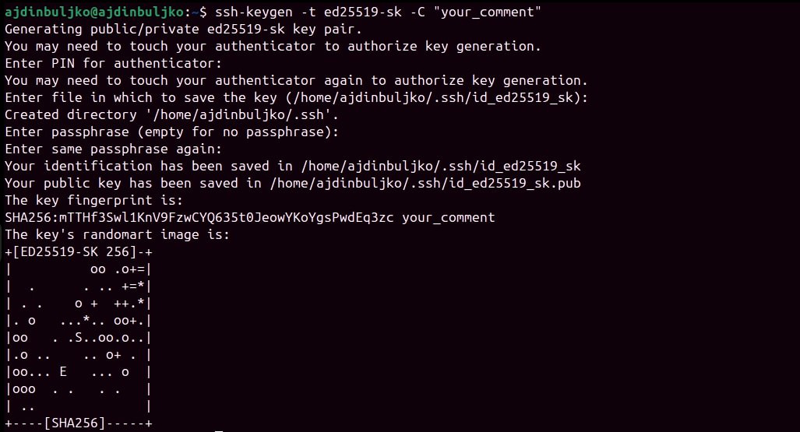

SSH Authentication with FIDO2
=============================

.. product-table:: nk3 passkey fido2

SSH (Secure Shell) is a network protocol used to securely access and manage remote systems such as servers or code repositories. It uses cryptographic key pairs for authentication, allowing passwordless logins with strong security.

With a Nitrokey, the private SSH key is generated and stored directly on the device, so it never leaves the hardware. Each login requires you to touch the Nitrokey, adding a simple physical confirmation that protects against unauthorized access. For example, when connecting to a server, GitLab, or GitHub.

Generating SSH Key
------------------

1. Insert the Nitrokey into your computer.

2. Open a terminal and create your SSH key. Replace ``"your_comment"`` with a label to identify it (e.g., "Nitrokey GitLab").  
   By default, the key is a non-resident key, meaning a local key handle is stored in ``~/.ssh/`` while the private key remains securely on the Nitrokey.  
   Use the ``-O resident`` option if you want the key to be portable across systems.

   .. code-block:: shell-session

      ssh-keygen -t ed25519-sk -C "your_comment"

   or to create a resident key
   
   .. code-block:: shell-session

      ssh-keygen -t ed25519-sk -O resident -C "your_comment"

   .. warning::

      The ``-O resident`` option stores key handles on the Nitrokey, allowing others with physical access to list them and see where the key was used.

   .. note::

      Resident keys can later be listed and imported on another system with:
      
      .. code-block:: shell-session

         ssh-keygen -K

4. During key generation, you may also be asked to set a **passphrase**. This passphrase encrypts the local key handle stored in ``~/.ssh/`` (not the private key on the Nitrokey, which always stays securely inside the device). The passphrase is **different from the FIDO2 device PIN**: the PIN protects the physical key itself, while the passphrase protects your local SSH key files. Using both increases overall security.

5. When asked for a file path, accept the default option (``~/.ssh/id_ed25519_sk``) or choose a custom name like ``id_ed25519_sk_gitlab``.

6. If the Nitrokey blinks, confirm the operation by touching it.

7. By executing the command, the following files will be created:

   ``~/.ssh/id_ed25519_sk`` → handle to the private key (stored securely on the Nitrokey)

   ``~/.ssh/id_ed25519_sk.pub`` → public key file

   .. note::

      The file names may differ if you specified a custom name when generating the key.

Adding Your Public Key
----------------------

Once your SSH key pair is generated, the public key must be added to the service or server you want to access.

For Git Services (GitLab, GitHub, etc.) 

1. Display your public key:

   .. code-block:: shell-session

      cat ~/.ssh/id_ed25519_sk.pub

   Example output (do not use this key)::
      
      sk-ssh-ed25519@openssh.com AAAAGnNrLXNzaC1lZDI1NTE5QG7wZW4zc2guY29tAAAAILeZl6r07HV4i1rK07OfLqD3J4IzX2q0lB6Ok0pdxoG5AAAABHNzaDo= your_comment

2. Copy the output and add it to your account’s SSH key settings.  

See `GitLab <https://docs.gitlab.com/user/ssh/#add-an-ssh-key-to-your-gitlab-account>` or `GitHub <https://docs.github.com/en/authentication/connecting-to-github-with-ssh/adding-a-new-ssh-key-to-your-github-account>` for detailed steps.

To enable SSH remote server access, add your public key (from ``~/.ssh/id_ed25519_sk.pub``) to the ``~/.ssh/authorized_keys`` file of the user account. This allows passwordless authentication using your Nitrokey.
