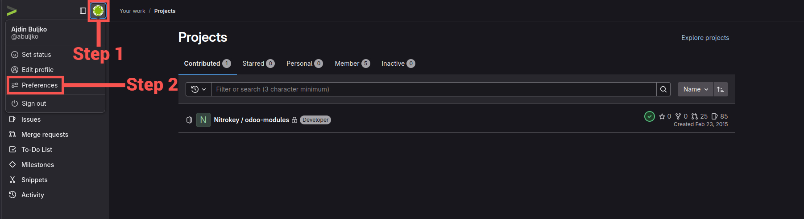
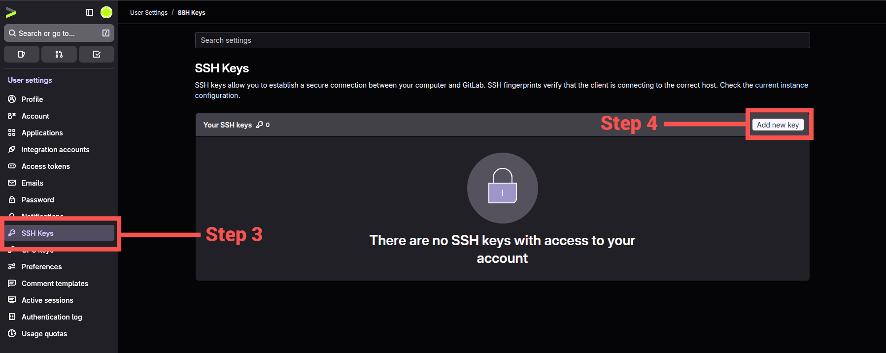
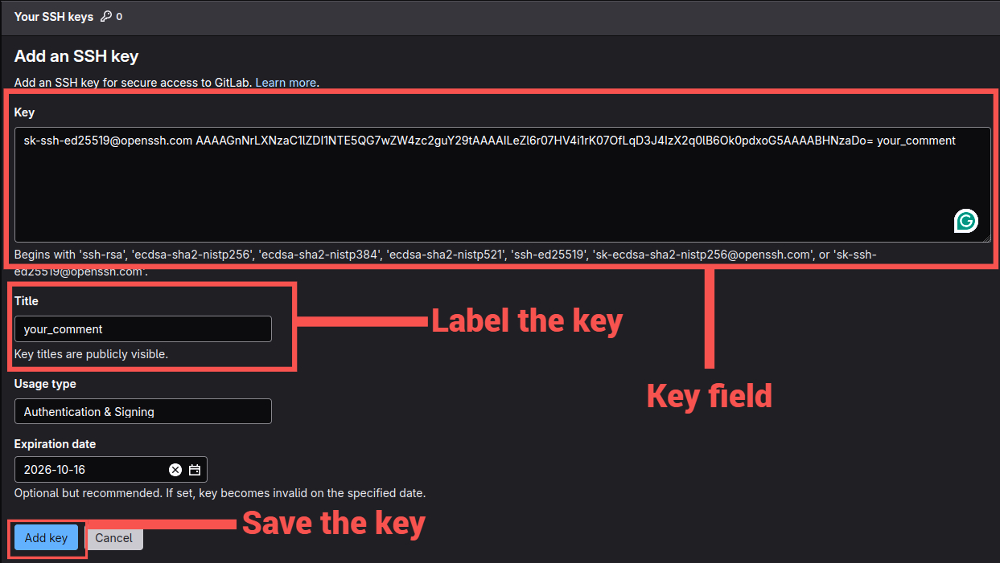

SSH Authentication with FIDO2
=============================

.. product-table:: nk3 passkey fido2

Use your Nitrokey 3A NFC for secure SSH login to GitLab and GitHub. The private key is generated and safely stored inside the device, 
ensuring it never leaves the hardware. Authentication requires a physical touch of the Nitrokey, providing strong protection against 
phishing and unauthorized access.

Requirements
------------
#. Nitrokey 3A NFC set up (FIDO2 enabled, optional PIN set). 
#. OpenSSH 8.2+ on your computer (adds FIDO2 ``*-sk`` keys). 

1. Generating SSH Key
---------------------
#. Insert the Nitrokey 3A NFC into your computer.

#. Open a terminal and execute the following command.  
   Replace `"your_comment"` with a note to identify your key (e.g., "Nitrokey GitLab").

   .. note::

      The ``-C "your_comment"`` parameter is **optional** — it only adds a comment to help identify your key (e.g., in GitLab or GitHub), 
      and the command will run normally without it.  

   .. code-block:: shell-session

      ssh-keygen -t ed25519-sk -C "your_comment"

   .. tip::

      During key generation, you may also be asked to set a **passphrase**. This passphrase encrypts the local key handle stored 
      in ``~/.ssh/`` (not the private key on the Nitrokey, which always stays securely inside the device). The passphrase is **different from 
      the FIDO2 device PIN**: the PIN protects the physical key itself, while the passphrase protects your local SSH key files. Using both 
      increases overall security.

#. When asked for a file path, accept the default option (``~/.ssh/id_ed25519_sk``) or choose a custom name like id_ed25519_sk_gitlab.

#. If the Nitrokey blinks, confirm the operation by touching it....

#. Optionally you can also set a passphrase (it is usually recommended for security reasons but not mandatory).

   .. note::

      By executing the command the following files will be created:

      ``~/.ssh/id_ed25519_sk`` → handle to the private key (stored securely on the Nitrokey)

      ``~/.ssh/id_ed25519_sk.pub`` → public key file

   .. figure:: images/ssh/terminal.png
      :alt: img0

2. Add your Public Key to your account
--------------------------------------

#. Enter this command to view your public key in the terminal: 

   .. code-block:: shell-session

      cat ~/.ssh/id_ed25519_sk.pub

Example output (do not use this key):

  sk-ssh-ed25519@openssh.com AAAAGnNrLXNzaC1lZDI1NTE5QG7wZW4zc2guY29tAAAAILeZl6r07HV4i1rK07OfLqD3J4IzX2q0lB6Ok0pdxoG5AAAABHNzaDo= your_comment

#. Copy the key to your account... 

2.1 How to add the SSH Key on GitLab
------------------------------------
#. Go to GitLab and follow this set of steps:  

  **1.** User Menu → **2.** Preferences → **3.** SSH Keys → **4.** Add new key

Step 1 and 2:

Step 3 and 4:

#. Paste your SSH Key in the Key field. 

#. Title it for example “Nitrokey 3A NFC (FIDO2)”. 

#. Then click the button “Add key”. 

2.2 How to add the SSH Key on GitHub
------------------------------------
#. Go to GitHub and follow this set of steps:  

  **1.** User Menu → **2.** Settings → **3.** SSH and GPG Keys → **4.** New SSH key 

Step 1 and 2:

   .. figure:: images/ssh/github(1,2).png
      :alt: img4

Step 3 and 4:

   .. figure:: images/ssh/github(3,4).png
      :alt: img5

#. Paste your SSH Key in the Key field. 

#. Title it for example “Nitrokey 3A NFC (FIDO2)”. 

#. Then click the save button “Add SSH key”. 

   .. figure:: images/ssh/github.png
      :alt: img6
