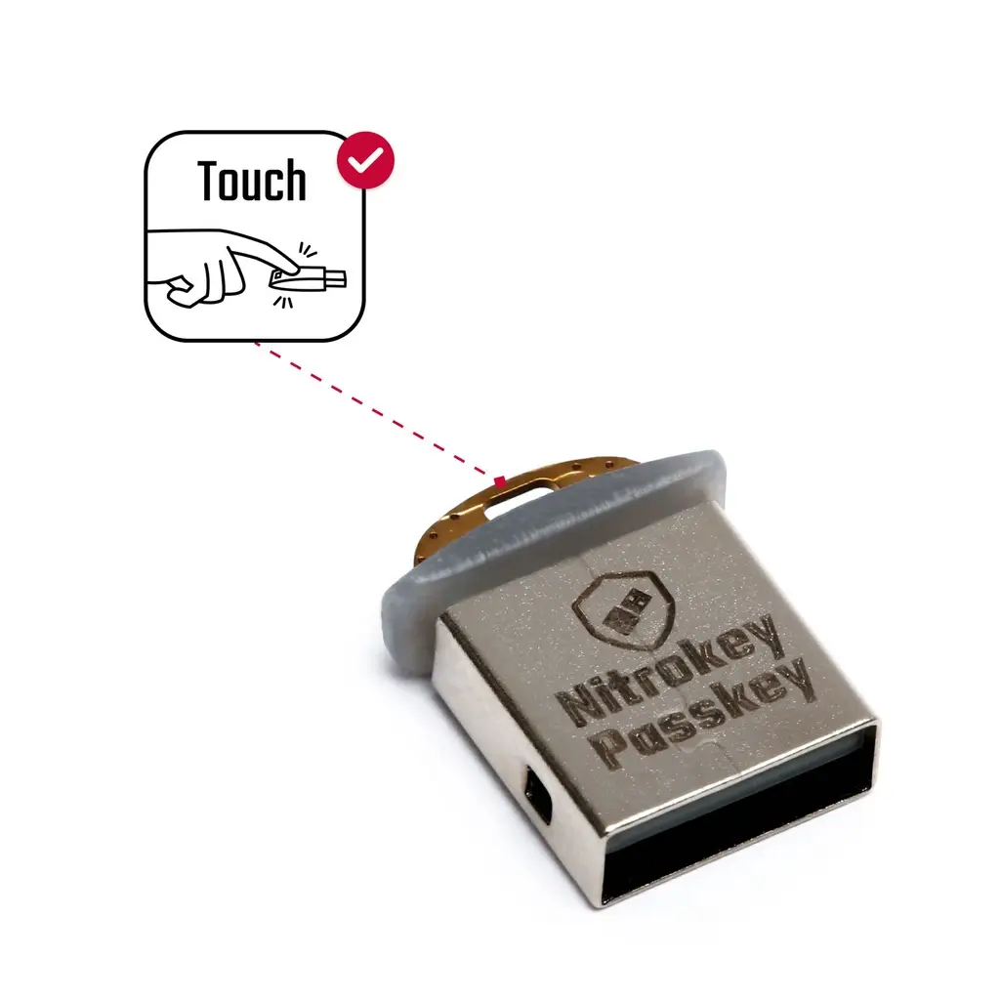

Hardware
========

Touch Button And LED Behavior
-----------------------------

The first FIDO operation is automatically accepted within two seconds
after connecting Nitrokey Passkey. In this case touching the touch button
is not required.

Multiple operations can be accepted by a single touch. For this, keep
the touch button touched for up to 10 seconds.

+------------------+-----------------------------+------------+
| LED Color        | Event                       | Comments   |
+==================+=============================+============+
| White (blinking) | waiting for touch event     |            |
+------------------+-----------------------------+------------+
| Teal (constant)  | processing                  |            |
+------------------+-----------------------------+------------+
| Red (Constant)   | Crash                       |            |
+------------------+-----------------------------+------------+

