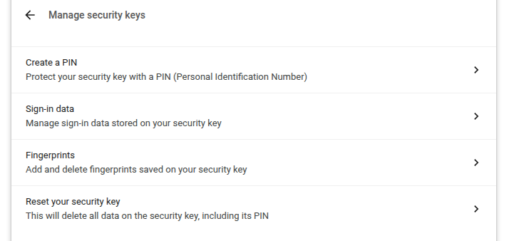
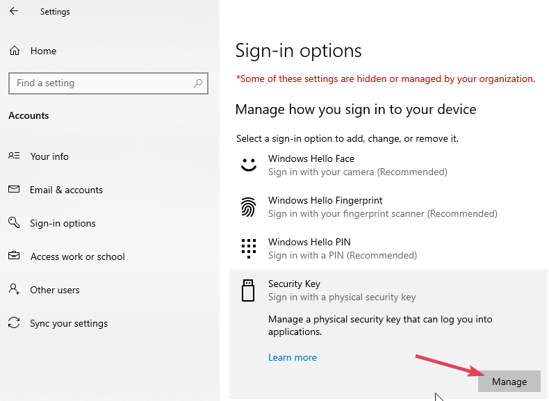
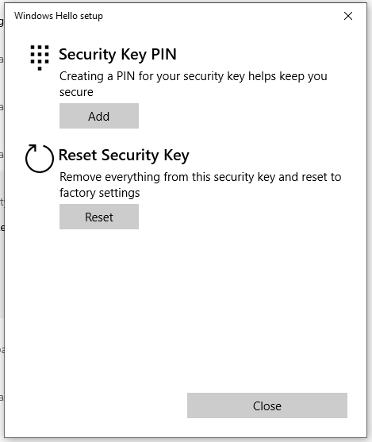

Manage Your Nitrokey Passkey
============================

Browser
-------

.. note::

    This works with all Chromium based web browsers and with all OSes.

In your Chromium based browser settings, go to "Privacy and security" → "Security" and "Manage security keys".

From this point you will have access to theses management options:

.. note::

    Some option may be shown but will not work with your Nitrokey eg. Fingerprints.

Windows
-------

In order to manage your Nitrokey Passkey in Windows, go to "Settings" → "Accounts" → "Sign-in options" → "Security Key" and click "Manage".

After touching your Nitrokey you will have two management options:

nitropy
-------

You can use the command line tool `nitropy`_ to manage the Nitrokey Passkey:

.. code-block:: bash

   ~ nitropy nkpk

   Command line tool to interact with Nitrokey devices 0.7.4
   Usage: nitropy nkpk [OPTIONS] COMMAND [ARGS]...

    Interact with Nitrokey Passkey devices, see subcommands.

    Options:
     -p, --path TEXT  The path of the Nitrokey 3 device
     -h, --help       Show this message and exit.

    Commands:
    fetch-update     Fetches a firmware update and stores it at the given...
    list             List all devices.
    reboot           Reboot the key.
    rng              Generate random data on the device.
    status           Query the device status.
    test             Run some tests on all connected devices.
    validate-update  Validates the given firmware image and prints the...
    version          Query the firmware version of the device.

.. _nitropy: ../../software/nitropy/index.html
