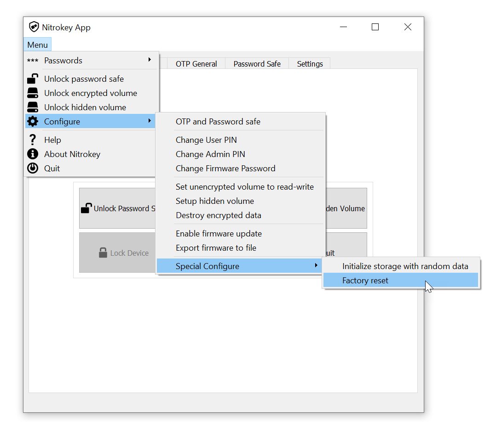

Factory Reset
=============

.. contents:: :local:

There are two types of factory resets for Nitrokey Pro devices:

- a factory reset of the OpenPGP smart card, for example using ``gpg
  --card-edit``, followed by ``admin`` and finally: ``factory-reset``
- a factory reset of the entire Nitrokey device using the Nitrokey App.

Also, it is possible to generate a new AES key that is used to encrypt the
Password Safe without performing a factory reset.

.. note::

   The Nitrokey App always generates a new AES key after performing a factory
   reset.

The factory reset can be triggered in the Nitrokey App with the menu entry
``Configure->Special Configure->Factory reset``.

.. note::

   The factory reset is an administrative function and is only available after
   starting the Nitrokey App with the parameter ``--admin``.

The following table describes the differences between these three operations:

===========================  =====================  ======================  ================
Property                     OpenPGP factory reset  Nitrokey factory reset  Generate AES key
===========================  =====================  ======================  ================
Requires admin PIN           no                     yes                     yes
Destroys OpenPGP keys        yes                    yes                     no
Destroys Password Safe       yes [1]_               yes                     yes [1]_
Destroys One-Time Passwords  no                     yes                     no
===========================  =====================  ======================  ================

.. [1] Clears the encryption key without overwriting the encrypted data.
