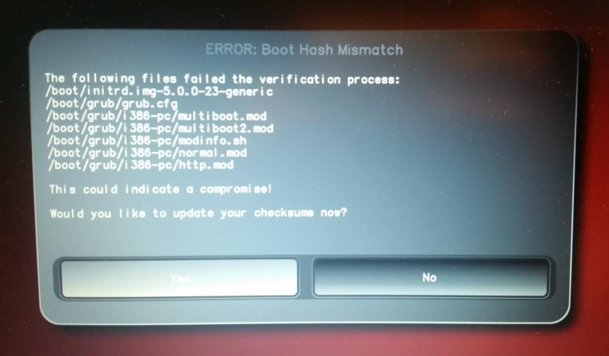

Behavior After a System Update
------------------------------

The NitroPad and NitroPC firmware checks certain system files for changes. If your
operating system has updated important components, you will be warned
the next time you boot the NitroPad or NitroPC. This could look like this, for
example:

That’s why it’s important to restart your NitroPad or your NitroPC under controlled
conditions after a system update. Only when the new status has been
confirmed can you leave the device unattended again. Otherwise, you will
not be able to distinguish a possible attack from a system update.
Detailed instructions for a system update can be `found
here <../heads/system-update.html>`_.