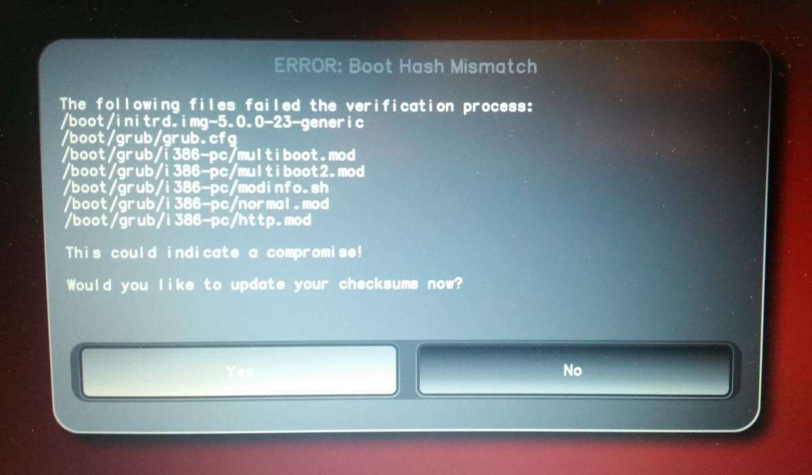

Ubuntu
======

.. contents:: :local:

.. toctree::
   :maxdepth: 1
   :glob:
   :hidden:

   *
.. Note::
   The jack port on the NitroPad T480s is not working automatically you can install 
   the `pavucontrol` program. Under Output Devices, you can select the headphones
   you've inserted manually.

Verification of Sealed Hardware
-------------------------------

If you have ordered the unit with the option “sealed screws and sealed
bag”, please `verify the sealing <../sealed-hardware.html>`_ before
unpacking. If you do not know what this means, skip this section.

Secure Starting Procedure
-------------------------

Before the first start you should get familiar with the `Secure Starting Procedure <../secure-starting-procedure.html>`__.

Workaround Ubuntu 24.04.
------------------------

There is an (`issue <https://github.com/linuxboot/heads/issues/1641>`__)that prevents Ubuntu to show the luks decryption screen if started with heads. Its there and you can type in your password blindly, after that Ubuntu starts normal. 
Follow these Steps: 

1. Heads starts. If nothing needs to be done, Ubuntu will start automatically

2. After a while, you will see a black screen with white writing on the last lines:         

   .. code-block:: shell-session

      Locking TPM2 platform hierarchy...  
      Starting the new kernel

   These lines indicate that Ubuntu is starting.

3. Wait **5 seconds** and then enter your **password** ("12345678" if you are starting it for the first time) followed by **Enter**.

4. Now you will see the normal Ubuntu screen. When you start for the first time, you must complete the initial configuration. 

Getting Started
---------------

After purchase, the passwords are set to a default value and must be
changed by you:

1. Press Enter (“Default Boot”) after booting the system, provided the
   NitroPad has not shown any errors and the Nitrokey is lit green (see
   above).

2. Next, the system will prompt you to enter the passphrase to decrypt
   the hard disk. The passphrase is initially "12345678". This was changed on the 10.04.2024 so if "12345678" is not working try the old default: "PleaseChangeMe" 

   .. figure:: ./images/UbuntuDiskPassword.png
      :alt: img3

3. The system will then guide you through the process of creating a user
   account. After that you should have successfully booted the system
   and could already use it normally.

4. Open the pre-installed Nitrokey App and change the PINs of your
   Nitrokey. To learn more about how to change the PINs, please refer to chapter `Change User and Admin PIN <../change-pins.html>`_.

5. Change the passphrase for disk encryption.
   To learn more about how to change the passphrase for disk encryption, please refer to chapter `Change Disk Encryption Passphrase <change-disk-encryption-passphrase.html>`_.
   This passphrase is different from your user acount's passphrase.

Behavior After a System Update
------------------------------

The NitroPad and NitroPC firmware checks certain system files for changes. If your
operating system has updated important components, you will be warned
the next time you boot the NitroPad or NitroPC. This could look like this, for
example:

That’s why it’s important to restart your NitroPad or your NitroPC under controlled
conditions after a system update. Only when the new status has been
confirmed can you leave the device unattended again. Otherwise, you will
not be able to distinguish a possible attack from a system update.
Detailed instructions for a system update can be `found here <../heads/system-update.html>`_.

