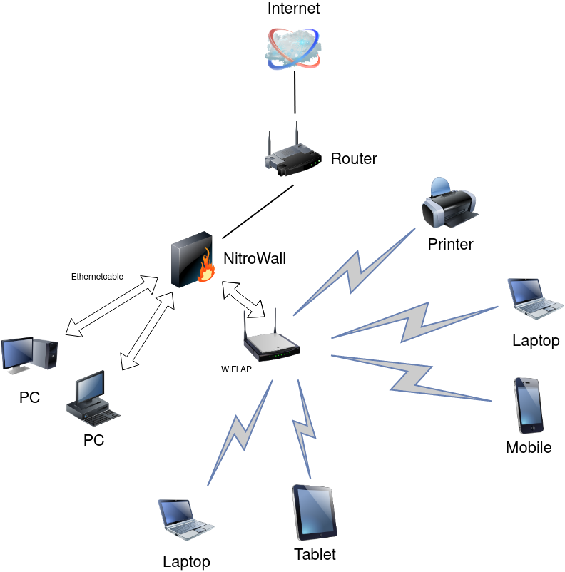

Using NitroWall as combined DHCP-Client/DHCP-Server
===================================================

.. warning:: Note the correct mapping of interfaces to physical ports: Interfaces → Assignments

1. In "System → Wizard → Configure WAN Interface" set the value for  IPv4 Configuration Type to DHCP
2. Follow this guide to configure the LAN interface for DHCP:

https://docs.opnsense.org/manual/dhcp.html#using-dhcpv4
	

