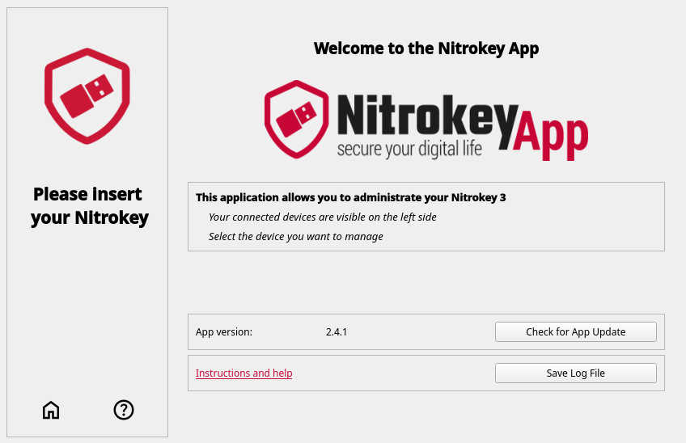

Nitrokey App 2
==============

The Nitrokey App 2 is a graphical application designed to manage Nitrokey 3 devices. It provides a user-friendly interface for configuring FIDO2 authentication, passwords, firmware updates, and PIN management.
Available languages: English, German, French, Italian, Polish, and Arabic. Language change requires application restart.

.. note::

   This application is compatible only with Nitrokey 3 devices. For Nitrokey Pro and Nitrokey Storage devices, please use `Nitrokey App 1 <https://www.nitrokey.com/download>`__.

Installation
------------

Download it for `Linux <installation-linux.html>`__ , `Windows <installation-windows.html>`__ or `macOS <installation-mac.html>`__.

Getting Started
---------------

- `Passwords <./passwords.html>`__
- `PIN Managment <./pin.html>`__
- `KeePassXC <./keepassxc.html>`__
- `Firmware Update <./update.html>`__

.. toctree::
   :maxdepth: 1
   :glob:
   :hidden:

   *
 
Overview
--------

The overview allows quick access to check the current app version, saving log files, and getting support.

App Version
***********

To ensure you are using the latest version of the application, click “Check for App Update.” 
If no updates are available, the button will display “App is up to date.”
If an update is available it will change the button text to "update available"
And by clicking once more it will open the release GitHub page where the latest one is on top. From here you will be able to download the binary if you want to do perfom a manual install

Log File
********

The “Save Log File” option lets you export a record of the application’s recent activity, including actions, errors, and system messages. This log file can help diagnose and resolve issues with the application.
