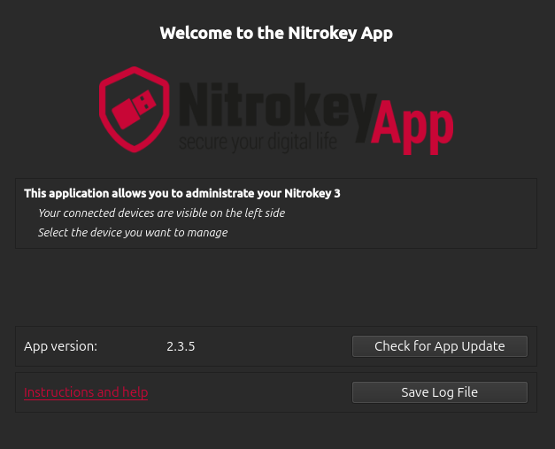
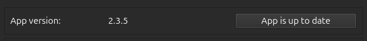

Nitrokey App 2
==============

The Nitrokey App 2 is a graphical application designed to manage Nitrokey 3 devices. It provides a user-friendly interface for configuring FIDO2 authentication, Passwords, firmware updates, and PIN management.
Available languages: English, German, French, Italian, Polish, and Arabic. Language change requires application restart.

.. note::

   This application is compatible only with Nitrokey 3 devices. For Nitrokey Pro and Nitrokey Storage devices, please use `Nitrokey App 1 <https://www.nitrokey.com/download>`__.

Installation
------------
Download it for `Linux <installation-linux.html>`__ , `Windows <installation-windows.html>`__ or `macOS <installation-mac.html>`__ (pipenv only).

Supported Features
------------------

- Updating the firmware
- One-Time Passwords (OTP)
- Passwords

.. toctree::
   :maxdepth: 1
   :glob:
   :hidden:

   *
 
Getting Started
---------------

Overview
********

The home page allows quick access to essential functions, including checking the current app version, saving log files, and getting support.

App Version
***********

To ensure you are using the latest version of the application, click “Check for App Update.”

If no updates are available, the button will display “App is up to date.”

Log File
********

The “Save Log File” option lets you export a record of the application’s recent activity, including actions, errors, and system messages. This log file can help diagnose and resolve issues with the application.

Need Help?
**********

Click the “?” icon or "Instructions and help" link on the home page for quick access to help content and troubleshooting.

