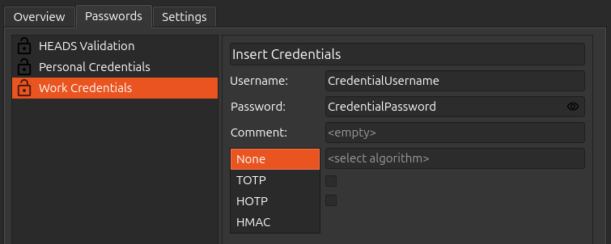

Passwords
=========

Password entries may consist of:

* Login name
* Password
* Comment (for e.g. a website reference)
* One-Time Passwords (HOTP and TOTP)
* Hash-Based Message Authentication Code (HMAC)

.. note::

    All fields are optional and can be edited and added at any time using the "Edit" button.

    You can store up to 50 passwords.

Adding Credentials
******************

1. To add a new entry click on the "Add" button.
2. Enter your user name.
3. Enter the password or OTP secret
4. You can enter the web address to the field Comment.
5. If you want to store a regular password, let "None" in the algorithm field. If you want to store a OTP or HMAC, choose the appropriate algorithm (see below) and copy the OTP secret or QR code that is given by the website (you want to login to) into the field next to it.

    .. figure:: ./images/TOTP-secret.png

    .. figure:: ./images/HOTP-secret.png

6. You can choose to add more security by checking the "Require PIN" or "Require Touch" boxes. Credentials with "Require PIN" (shown as a closed lock) can only be accessed by entering a device the PIN when clicking on "Show Protected Passwords". Unprotected credentials (shown as an open lock) can be accessed without entering a device PIN.

7. Once all desired fields are filled click on "Save".

.. Note::

    You need first to set a device PIN before using "Require PIN". Otherwise it will show an error.
    The device PIN can be set or changed in the `settings <./pin.html#passwords>`__).

.. important::
    
    You are allowed only 8 attempts to enter a device PIN otherwise you will not be able to access or create new credentials and you will need to perform a factory reset in order to use this feature again.

Login
*****

Once your credential is stored you can login to your account with these steps:

1. Select on the left side your Nitrokey on which your credential is stored.
2. Click on the "Passwords" tab.
3. Click on your desired credential, if your credential is protected click on "Show Protected Passwords" first.
4. If it's a regular password, copy the username and the password into the login prompt. If it's a OTP credential, click the “OTP” icon to generate the OTP and enter the OTP code into the appropriate field in the login prompt. (For HOTP, press the button again to generate a new code.)

    .. figure:: ./images/TOTP-code.png

OTP Algorithms
**************

One-Time Passwords (OTPs) are used as multi-factor authentication (MFA) designed to make it much harder for hackers to access protected information such as online accounts.
With the Nitrokey App 2 and your Nitrokey you can use two different MFA:

* TOTP or Time-based One-Time Password is a two-factor authentication code that changes at regular time intervals (e.g. 60 seconds). This is the standard typically used by websites.
* HOTP or HMAC-based One-Time Password is a two factor authentication code that changes each time it's requested and validated. It is rarely used today.
* HMAC is primarily used with KeePassXC.

.. Note::

    For a list of websites supporting OTPs have a look at `dongleauth.com <https://www.dongleauth.com/>`__.

You can test TOTP with `this <https://authenticationtest.com/totpChallenge/>`__ website.
