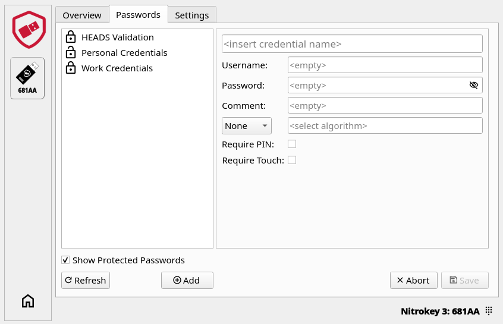

Passwords
=========
Store and Manage Credentials
****************************

Password entries may consist of:

* Login name
* Password
* Comment (for e.g. a website reference)
* One-Time Passwords (HOTP and TOTP)
* Hash-Based Message Authentication Code (HMAC)

.. note::

    All fields are optional and can be edited and added at any time using the "Edit" button.

    You can store up to 100 passwords.

To add a new entry click on the "Add" button:

Entries are divided into two categories: unprotected (shown as an open lock) and protected (shown as a closed lock). 
    
Unprotected entries can be accessed directly. 

Protected entries can only be accessed with the PIN by clicking on "Show Protected Passwords". 

If your credential don't use two-factor authentication let "None" in the algorithm field.

You can choose to add more security by checking the "Require PIN" or "Require Touch" boxes.

The password PIN can be set or changed in the settings.

If a PIN has been set, it must be entered before making any changes. 

.. important::
    
    You are allowed only 8 attempts otherwise you will not be able to access or create new credentials and you will need to perform a factory reset in order to use this feature again.

Password Algorithms
-------------------

.. Note::

    For a list of websites supporting OTPs have a look at `dongleauth.com <https://www.dongleauth.com/>`__.

OTPs are used as multi-factor authentication (MFA) disigned to make it much harder for hackers to access protected Information such as online accounts.

With the Nitrokey App 2 and your Nitrokey you can use two different MFA:

* TOTP or Time-based One-Time Password is a two-factor authentication code that changes at regular time intervals (60 seconds).

* HOTP or HMAC-based One-Time Password is a two factor authentication code that changes each time it's requested and validated. 

HMAC or Hash-Based Message Authentication Code is a cryptographic technique used in both TOTP and HOTP used to confirm that data is authentic and has not been altered by combining a secret key with a message. 

While creating a credential that uses TOTP or HOTP you will need to copy the MFA secret or QR code that is given by the website in the algorithm field.

.. figure:: ./images/HOTP-secret.png

You can test TOTP with `this <https://authenticationtest.com/totpChallenge/>`__ website.

Login
_____

During login with TOTP or HOTP you will need to generate the OTP.

Select in the password list the desired saved credential, then in the TOPT or HOTP line click the “OTP” logo to generate the OTP. 

For TOTP it will generate the same code using the shared key (MFA secret) and current time to verify your identity.

For HOTP it will uses the same counter and key to verify the code. The counter only increases when the code is used, press the button again to generate a new code.
