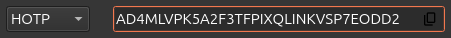

Passwords
=========

.. note::
    You can store up to 50 passwords.

Password entries may consist of:

* Login name
* Password
* Comment (for e.g. a website reference)
* One-time password (HOTP or TOTP)

All fields are optional and can be edited and added at any time using the "Edit" button.

For a list of websites supporting OTP have a look at `dongleauth.com <https://www.dongleauth.com/>`__.

Usage
-----

Entries are divided into two categories: unprotected (shown as an open lock) and protected (shown as a closed lock). Unprotected entries can be accessed directly. Protected entries can only be accessed with the PIN. 

You can choose to create a protected entry by checking the "Protect with PIN" box when adding a new entry.

You also have the option to require user presence in the form of a required touch on the Nitrokey 3 to access the entry by checking the "Require User Presence" box.

Store and Manage Credentials
----------------------------

When adding credentials in the Passwords tab, select an algorithm from the drop down menu. Plain usernames using a password, HOTPs, TOTPs, and HMAC are all supported.

.. figure:: ./images/credential-example.png

Select the option “None” to skip two-factor authentication and use a standard username and password combination. Enter a username and a password that only you know, as shown in the example above. The method relies solely on your password for authentication.

Password Algorithms
*******************

To use a password algorithm, go to security settings of the application you want to secure and enable two-factor authentication. Choose the “Authenticator App” or “Manual Setup” option if available. 

The service will show a secret key or a QR code. Copy this secret key to enter into your credential setup. Go to the Passwords tab of the Nitrokey App 2 and add a new credential. Choose the algorithm you want to use and paste the secret key. Save the credential.

TOTP
++++

TOTP or Time-based One-Time Password is a two-factor authentication code that changes at regular time intervals. Enter the shared secret key into the field provided.

.. figure:: ./images/TOTP-secret.png

After the credential is saved, click the “OTP” button to generate a 6 digit code that expires in 60 seconds. The system you’re logging into generates the same code using the shared key and current time to verify your identity.

.. figure:: ./images/TOTP-code.png

HOTP
++++

HOTP or HMAC-based One-Time Password is a two factor authentication code that changes each time you trigger it. Enter the shared secret key into the field provided.

Once the credential is saved, click the “OTP” button to generate a 6 digit code based on a counter. The system you’re logging into uses the same counter and key to verify the code. The counter only increases when the code is used, press the button again to generate a new code.

.. figure:: ./images/HOTP-code.png

HMAC
++++

HMAC or Hash-Based Message Authentication Code is a security method used to confirm that data is authentic and has not been altered by combining a secret key with a message. Enter the shared secret key in the field provided or click the refresh button to have the app generate a secret key for you.

.. figure:: ./images/HMAC-secret.png

Once the credential is saved, the app will use a hash function to generate a code and verify the integrity of your message based on your secret key. 

Verification Requirements
*************************

If a PIN has been set, it must be entered before making any changes. You are allowed only 8 attempts otherwise you will not be able to access or create new credentials and you will need to perform a factory reset in order to use this feature again.

For certain actions, you will be prompted to press your Nitrokey to continue. Watch for a flashing green light on your Nitrokey device and icon.

.. figure:: ./images/flashing-green-icon.png

You may also apply these additional settings to your credentials when creating them. Simply check the boxes for any options you wish to enable.

