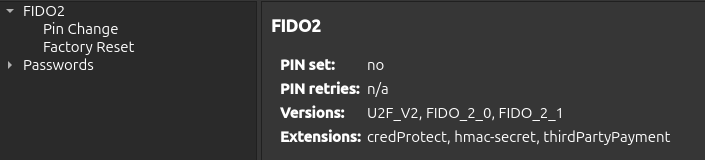
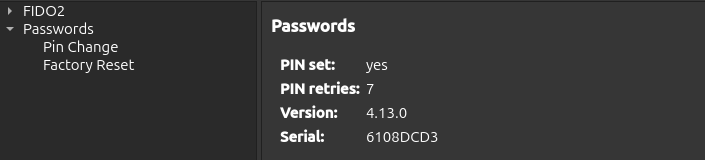

PIN Managment
=============

To enhance security, PINs can be created to restrict access to FIDO2 credentials and stored passwords.

.. important::

    FIDO2, Passwords, PIV, and OpenPGP Card use separate PINs, which are managed individually.

Prerequisite
------------

- Nitrokey App 2 in version 2.3.1 or later.

PIN Management
--------------

1. Open the Nitrokey App 2.
2. Select your Nitrokey device.
3. Select the ``SETTINGS`` tab.
4. On the left-hand side of the ``SETTINGS`` tab, a tree structure with various options is available.
5. Select ``Passwords`` or ``FIDO2``
6. Select ``Pin Change``
7. To set the PIN, enter the new PIN and repeat it in the provided boxes. To change an existing PIN, enter the current PIN in the box provided. The minimum PIN length is 4 characters.
8. Select the ``SAVE`` button. If the ``SAVE`` button is greyed out, the entries are not correct. When you hover over the ``SAVE`` button, the reasons are displayed. The ``PIN_INVALID`` error message, when changing the PIN, indicates that the current PIN is incorrect. 

Factory Reset
-------------

A factory reset witll reset the entire ``Passwords`` or ``FIDO2`` feature including all stored credentials. To do so proceed as follows:

1. Open the Nitrokey App 2.
2. Select your Nitrokey device.
3. Select the ``SETTINGS`` tab.
4. On the left-hand side of the ``SETTINGS`` tab, a tree structure with various options is available.
5. Select ``Passwords`` or ``FIDO2``
6. Select Factory Reset.
7. Press the button Reset.
8. Touch your Nitrokey for confirmation.

.. Note::

    Factory reset for FIDO2 can only be done within 10 seconds of plugging in your device.

