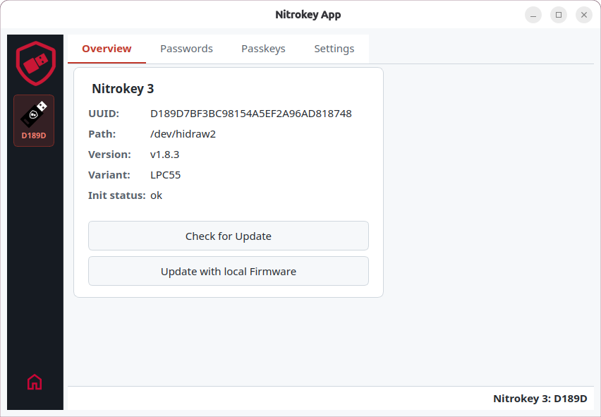

Firmware Update
===============

.. important::
   When updating your device, remove all other Nitrokey 3 devices except the one being updated.

Automatic Update
----------------

Open the “overview” tab to automatically and manually update your device. Click “Check for Update”  button to start the automatic update process. The firmware files will be downloaded and used to update your Nitrokey.

Manual (Local) Update
---------------------

If you have the firmware file already on your computer, click “Update with local Firmware” in the “overview” tab to update the device with your local firmware.

