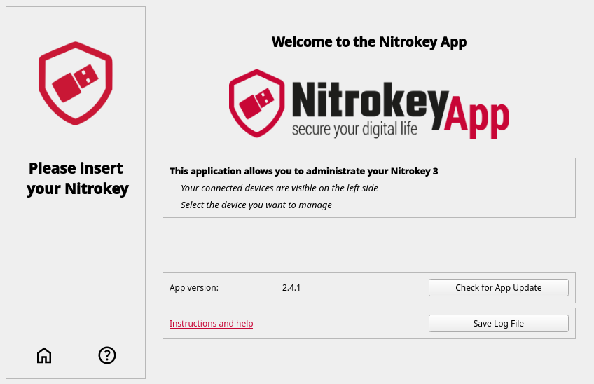

Firmware Updates
================

Automatic Updates
*****************

Open the “overview” tab to automatically and manually update your device. Click “Check for Update”  button to start the automatic update process. The firmware files will be downloaded and used to update your Nitrokey. 

Manual (Local) Update
*********************

If you have the firmware files already on your computer, click “More Options” to manually update the device with your local firmware.

.. important:: 
    When updating your device, remove all other Nitrokey 3 devices except the one being updated.
