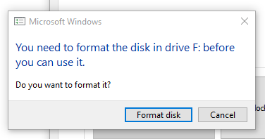

3. *If this is the first time you unlock the hidden volume, you may need to create a partition on the hidden volume. In this case, Windows will prompt you to do so. You can then format the hidden volume using FAT32, for compatibility with most operating systems.*

.. figure:: ./images/format-tool.png
  :alt: Windows formating tool
