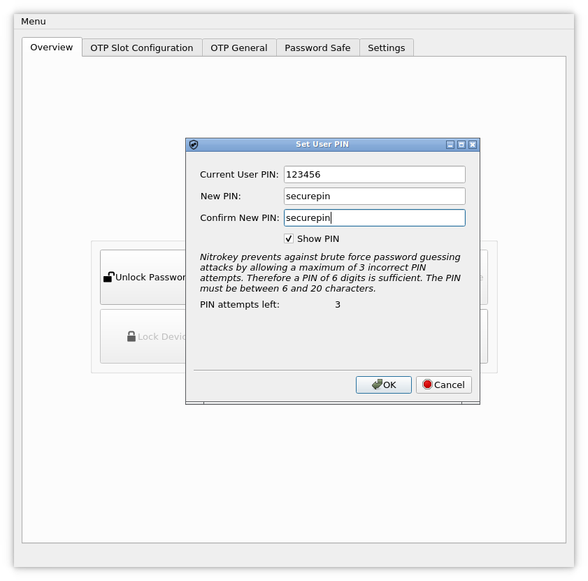
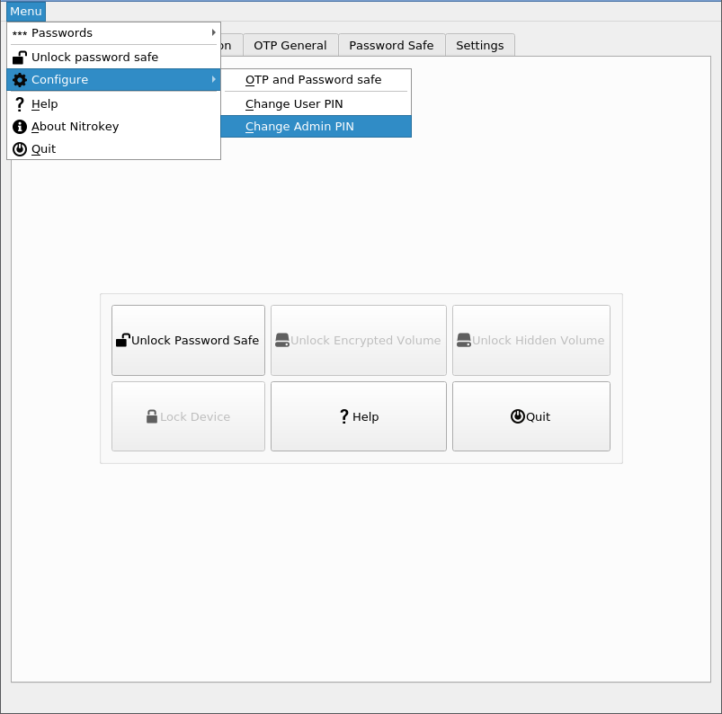

# Change User and Amin PIN

## User PIN

The user PIN is at least 6-digits long and is used to get access to the contect of the Nitrokey. This is the PIN you will use a lot in every day use e.g. for decrypting messages, for unlocking your encrypted storage (NK Storage only) etc.

You can change the user PIN with the Nitrokey App if using a Nitrokey Pro or Nitrokey Storage. In the [Nitrokey](https://www.nitrokey.com/download) App open 'Menu -> Configure -> Change User PIN' to open the dialog to change the PIN.

You can change the User PIN in the dialog window now.

The user PIN can have up to 20 digits and other characters (e.g. alphabetic and special characters). But as the user PIN is blocked as soon three wrong PIN attempts were done, it is sufficiently secure to only have a 6 digits PIN. The default PIN is 123456.

## Admin PIN

The admin PIN is at least 8-digits long and is used to change contents/settings of the Nitrokey. That is to say after initializing the Nitrokey you probably won't need this PIN too often (e.g. if you want to add another password to the password safe of the Nitrokey Pro or Nitrokey Storage).

You can change the admin PIN with the Nitrokey App if using a Nitrokey Pro or Nitrokey Storage. In the [Nitrokey App](https://www.nitrokey.com/download) open 'Menu -> Configure -> Change Admin PIN' to open the dialog to change the PIN.

You can change the admin PIN in the dialog window now.

The admin PIN can have up to 20 digits and other characters (e.g. alphabetic and special characters). But as the admin PIN is blocked as soon three wrong PIN attempts were done, it is sufficiently secure to only have 8 digits PIN. The default PIN is 12345678.

